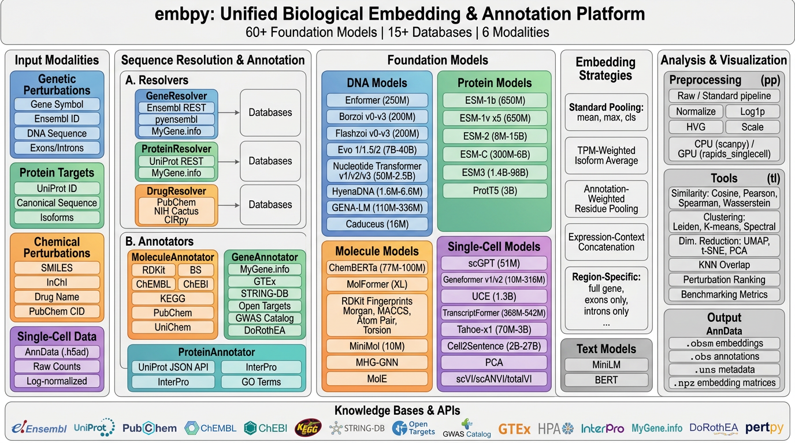
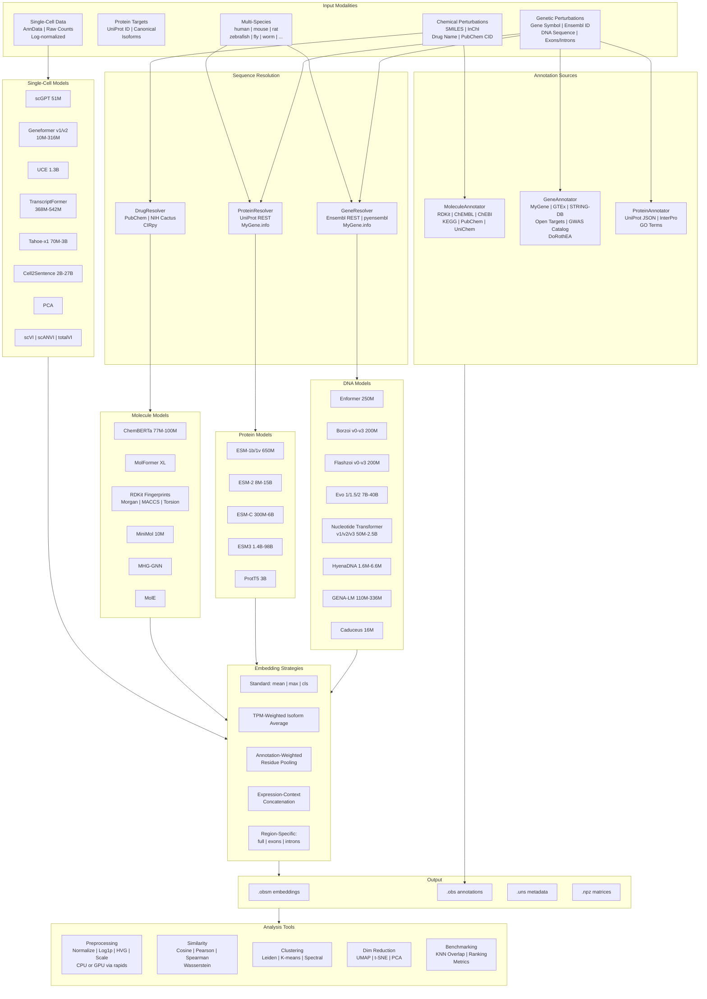

# embpy

[![Tests][badge-tests]][tests]
[![Documentation][badge-docs]][documentation]

[badge-tests]: https://img.shields.io/github/actions/workflow/status/grpinto/embpy/test.yaml?branch=main
[badge-docs]: https://img.shields.io/readthedocs/embpy

**embpy** is a Python package for generating embeddings of biological perturbations and cell lines using 60+ foundation models through a unified interface.

Given a perturbation (genetic or chemical) and/or single-cell expression data, embpy resolves the underlying biological sequences, routes them to the appropriate foundation models, and returns dense vector representations ready for downstream machine learning.

## Workflow

<p align="center">
  
</p>

## Architecture

<p align="center">
  
</p>

<details>
<summary>Mermaid diagram (click to expand)</summary>



</details>

## Key Features

- **60+ foundation models** across DNA, protein, molecule, single-cell, and text modalities
- **Unified `BioEmbedder` interface** -- one class to access all models with automatic sequence resolution
- **Multi-species support** -- embed and annotate genes from any Ensembl-supported organism (human, mouse, rat, zebrafish, fly, worm, yeast, ...) with automatic species-aware sequence resolution via Ensembl REST, UniProt, MyGene.info, and STRING-DB
- **`embed_adata()`** -- embed cells and perturbations together in a single call
- **Weighted protein embeddings** -- TPM-weighted isoform averaging, annotation-weighted residue pooling, expression-context concatenation
- **Text knowledge embeddings** -- `TextResolver` fetches descriptions from 6 public sources (MyGene, NCBI, Ensembl, UniProt, Wikipedia, PubChem); `embed_description()` resolves + embeds in one call
- **Boltz-2 structure embeddings** -- extract trunk representations (single per-residue + pairwise interaction features) from the Boltz-2 biomolecular foundation model
- **Multi-source annotation** -- `MoleculeAnnotator` (RDKit, ChEMBL, ChEBI, KEGG, PubChem), `GeneAnnotator` (MyGene, GTEx, STRING-DB, Open Targets, GWAS Catalog), `ProteinAnnotator` (UniProt functional metadata, InterPro domains)
- **20 visualization functions** in `embpy.pl` -- heatmaps, clustermaps, UMAP/t-SNE, parallel coordinates, radar charts, star coordinates, dendrograms, cross-model comparison
- **GPU acceleration** via rapids_singlecell for preprocessing, PCA, UMAP, neighbors, and Leiden
- **Batch processing** with SLURM array job scripts for full-genome embedding
- **scverse integration** -- AnnData-native throughout, compatible with scanpy/scvi-tools/pertpy

## Quick Start

### Embed a gene with a DNA model

```python
from embpy.embedder import BioEmbedder

embedder = BioEmbedder(device="auto")

# DNA embedding (resolves gene -> genomic sequence -> model)
emb = embedder.embed_gene("TP53", model="enformer_human_rough", pooling_strategy="mean")
print(emb.shape)  # (3072,)
```

### Embed a protein with ESM-2

```python
# Protein embedding (resolves gene -> UniProt sequence -> model)
emb = embedder.embed_gene("TP53", model="esm2_650M", pooling_strategy="mean")
print(emb.shape)  # (1280,)

# All isoforms
isoforms = embedder.embed_protein("TP53", model="esm2_650M", isoform="all")
for iso_id, emb in isoforms.items():
    print(f"  {iso_id}: {emb.shape}")
```

### Embed a small molecule

```python
emb = embedder.embed_molecule("CC(=O)OC1=CC=CC=C1C(=O)O", model="chemberta2MTR")
print(emb.shape)  # (768,)
```

### Embed cells from an AnnData

```python
import anndata as ad

adata = ad.read_h5ad("perturbseq.h5ad")

result = embedder.embed_cells(
    adata,
    models=["pca", "scvi", "scgpt"],
    preprocessing="standard",
    n_pca_components=50,
    n_latent=30,
)
# result.obsm["X_pca"]   -> (n_cells, 50)
# result.obsm["X_scvi"]  -> (n_cells, 30)
# result.obsm["X_scgpt"] -> (n_cells, 512)
```

### Combined cell + perturbation embedding

```python
result = embedder.embed_adata(
    adata,
    cell_models=["pca", "scgpt"],
    perturbation_models=["esm2_650M"],
    perturbation_column="perturbation",
    perturbation_type="auto",
)
# Cell embeddings + perturbation embeddings side by side in .obsm
```

### Weighted perturbation embedding

```python
from embpy.tl import WeightedProteinEmbedder

wpe = WeightedProteinEmbedder(embedder)

# TPM-weighted isoform average
emb = wpe.embed_perturbation(
    "TP53", model="esm2_650M", strategy="tpm_weighted",
    tpm_values={"P04637": 45.2, "P04637-2": 12.8},
)

# Annotation-weighted: active/binding sites get 3x weight
emb = wpe.embed_perturbation(
    "TP53", model="esm2_650M", strategy="annotation_weighted",
    site_boost=3.0,
)
```

### Multi-species embedding

```python
# Mouse gene embeddings using Borzoi mouse weights
mouse_embedder = BioEmbedder(device="auto", organism="mouse")
emb = mouse_embedder.embed_gene("Trp53", model="borzoi_v0_mouse", pooling_strategy="mean")

# Cross-species protein comparison with ESM-2
human_embedder = BioEmbedder(device="auto", organism="human")
human_tp53 = human_embedder.embed_protein("TP53", model="esm2_650M")
mouse_trp53 = mouse_embedder.embed_protein("Trp53", model="esm2_650M")

# Mouse gene annotations (STRING PPI uses mouse taxon 10090)
from embpy.resources.gene_annotator import GeneAnnotator
mouse_ann = GeneAnnotator(organism="mouse")
ppi = mouse_ann.get_protein_interactions("Trp53")
```

### Text knowledge embeddings

```python
# Fetch descriptions from 6 knowledge sources and embed them
emb = embedder.embed_description("TP53", model="minilm_l6_v2")

# Inspect descriptions before embedding
from embpy.resources import TextResolver
tr = TextResolver(organism="human")
descs = tr.get_gene_description("BRCA1")
for source, text in descs.items():
    print(f"[{source}] {text[:100]}...")

# Embed custom text directly
emb = embedder.embed_text("TP53 is a tumor suppressor gene.", model="minilm_l6_v2")
```

### Boltz-2 structure embeddings

```python
# Single representation from Boltz-2 pairformer trunk (~384 dims)
emb = embedder.embed_protein("TP53", model="boltz2", pooling_strategy="mean")

# Pairwise interaction features (~128 dims)
emb_z = embedder.embed_protein("TP53", model="boltz2_pairwise")

# Both concatenated (~512 dims)
emb_both = embedder.embed_protein("TP53", model="boltz2_both")
```

### Annotate perturbations

```python
from embpy.tl import annotate_molecules, annotate_gene_perturbations, annotate_proteins

# Molecule annotations (physicochemical, bioactivities, pathways, diseases)
adata = annotate_molecules(adata, column="drug_name")

# Gene annotations (pathways, tissue expression, PPI, diseases)
adata = annotate_gene_perturbations(adata, column="gene")

# Protein annotations (UniProt function, domains, PTMs, GO terms)
adata = annotate_proteins(adata, column="gene")
```

## Available Models

### DNA Models

| Model | Key | Parameters |
|---|---|---|
| Enformer | `enformer_human_rough` | 250M |
| Borzoi (4 replicates) | `borzoi_v0` -- `borzoi_v3` | 200M |
| Borzoi Mouse | `borzoi_v0_mouse` -- `borzoi_v3_mouse` | 200M |
| Flashzoi (4 replicates) | `flashzoi_v0` -- `flashzoi_v3` | 200M |
| Evo 1 / 1.5 | `evo1_8k`, `evo1_131k`, `evo1.5_8k` | 7B |
| Evo 2 | `evo2_7b`, `evo2_40b` | 7B / 40B |
| Nucleotide Transformer v1/v2 | `nt_500m_human_ref`, `nt_v2_500m`, ... | 50M -- 2.5B |
| Nucleotide Transformer v3 | `ntv3_100m_pre`, `ntv3_650m_pos`, ... | 8M -- 650M |
| HyenaDNA | `hyenadna_tiny_1k` -- `hyenadna_large_1m` | 1.6M -- 6.6M |
| GENA-LM | `gena_lm_bert_base`, `gena_lm_bert_large`, ... | 110M -- 336M |
| Caduceus | `caduceus_ph_131k`, `caduceus_ps_131k` | 16M |

### Protein Models

| Model | Key | Parameters |
|---|---|---|
| ESM-1b | `esm1b` | 650M |
| ESM-1v (5 seeds) | `esm1v_1` -- `esm1v_5` | 650M |
| ESM-2 | `esm2_8M` -- `esm2_15B` | 8M -- 15B |
| ESM-C | `esmc_300m`, `esmc_600m`, `esmc_6b` | 300M -- 6B |
| ESM3 | `esm3_small`, `esm3_medium`, `esm3_large` | 1.4B -- 98B |
| ProtT5 | `prot_t5_xl`, `prot_t5_xl_half` | 3B |
| Boltz-2 | `boltz2`, `boltz2_pairwise`, `boltz2_both` | ~400M (trunk) |

### Molecule Models

| Model | Key | Type |
|---|---|---|
| ChemBERTa | `chemberta2MTR`, `chemberta2MLM` | Transformer |
| MolFormer | `molformer_base` | Transformer |
| RDKit Fingerprints | `rdkit_fp`, `morgan_fp`, `maccs_fp`, ... | Classical |
| MiniMol | `minimol` | GNN |
| MHG-GNN | `mhg_gnn` | Hypergraph GNN |
| MolE | `mole` | Graph Transformer |

### Single-Cell Foundation Models

| Model | Key | Parameters |
|---|---|---|
| scGPT | `scgpt` | 51M |
| Geneformer v1/v2 | `geneformer_v1_6L` -- `geneformer_v2_18L` | 10M -- 316M |
| UCE | `uce` | 1.3B |
| TranscriptFormer | `transcriptformer_metazoa`, `transcriptformer_sapiens` | 368M -- 542M |
| Tahoe-x1 | `tahoe_70m`, `tahoe_1b`, `tahoe_3b` | 70M -- 3B |
| Cell2Sentence-Scale | `cell2sentence_2b`, `cell2sentence_27b` | 2B -- 27B |
| PCA | `pca` | -- |
| scVI / scANVI / totalVI | `scvi`, `scanvi`, `totalvi` | -- |

### Text Models

| Model | Key |
|---|---|
| MiniLM | `minilm_l6_v2` |
| BERT | `bert_base_uncased` |

## Installation

Requires **Python 3.11+**. Choose the method that best fits your workflow.

### Option 1: Mamba / Conda (recommended for HPC)

The fastest way to get a fully working environment with GPU support, RDKit,
and all compiled dependencies resolved automatically.

```bash
# GPU environment (CUDA 12.4)
git clone https://github.com/theislab/embpy.git
cd embpy
mamba env create -f environment.yml
mamba activate embpy
```

```bash
# CPU-only environment
mamba env create -f environment-cpu.yml
mamba activate embpy-cpu
```

The environment files install PyTorch, RDKit, and the core scientific stack
via conda-forge, then install embpy and its Python-only dependencies via pip.

To add optional extras after activation:

```bash
pip install ".[evo2,helical]"    # add Evo2 + single-cell models
pip install ".[all]"             # everything
```

### Option 2: uv (fastest pip alternative)

[uv](https://docs.astral.sh/uv/) is a drop-in pip replacement that resolves
and installs packages 10-100x faster.

```bash
# Install uv if you don't have it
pip install uv

# CPU install
uv pip install git+https://github.com/theislab/embpy.git@main

# GPU install (CUDA 12.4)
uv pip install "embpy[torch-cu124]" --extra-index-url https://download.pytorch.org/whl/cu124

# Full GPU install with all extras
uv pip install "embpy[all-cu124]" --extra-index-url https://download.pytorch.org/whl/cu124

# Development install (editable)
git clone https://github.com/theislab/embpy.git
cd embpy
uv pip install -e ".[dev,test]"
```

### Option 3: pip

```bash
# Base install (CPU) -- includes all HuggingFace models
pip install git+https://github.com/theislab/embpy.git@main

# GPU install -- pick your CUDA version
pip install "embpy[torch-cu121]" --extra-index-url https://download.pytorch.org/whl/cu121
pip install "embpy[torch-cu124]" --extra-index-url https://download.pytorch.org/whl/cu124
pip install "embpy[torch-cu128]" --extra-index-url https://download.pytorch.org/whl/cu128

# Full GPU install (CUDA 12.4)
pip install "embpy[all-cu124]" --extra-index-url https://download.pytorch.org/whl/cu124
```

### Optional extras

Install only what you need:

| Extra | What it enables |
|---|---|
| *(base)* | GENA-LM, NT v1/v2/v3, HyenaDNA, ESM-2/C, ProtT5, ChemBERTa, MolFormer, RDKit |
| `caduceus` | Caduceus (SSM/Mamba DNA model, requires CUDA) |
| `evo` | Evo v1/v1.5 |
| `evo2` | Evo 2 |
| `helical` | Single-cell foundation models (scGPT, Geneformer, UCE, TranscriptFormer, Tahoe, Cell2Sentence) |
| `boltz` | Boltz-2 structure embeddings (requires CUDA) |
| `ppi` | PPI GNN encoder |
| `pertpy` | pertpy metadata annotation |
| `scanpy` | scanpy integration |
| `all` | Everything above |

```bash
# Mix and match
pip install "embpy[torch-cu124,helical,evo2,pertpy]" \
  --extra-index-url https://download.pytorch.org/whl/cu124
```

### Verifying the installation

```python
from embpy.embedder import BioEmbedder

embedder = BioEmbedder(device="auto")
print(f"Device: {embedder.device}")
print(f"Models: {len(embedder.list_available_models())} available")
```

## Tutorials

| # | Topic | Notebook |
|---|---|---|
| 01 | Identifiers and Preprocessing | [01_identifiers_and_preprocessing.ipynb](docs/notebooks/01_identifiers_and_preprocessing.ipynb) |
| 02 | Gene (DNA) Embeddings | [02_gene_embeddings.ipynb](docs/notebooks/02_gene_embeddings.ipynb) |
| 03 | Protein Embeddings + Isoforms | [03_protein_embeddings.ipynb](docs/notebooks/03_protein_embeddings.ipynb) |
| 04 | Molecule Embeddings | [04_molecule_embeddings.ipynb](docs/notebooks/04_molecule_embeddings.ipynb) |
| 05 | Text Embeddings | [05_text_embeddings.ipynb](docs/notebooks/05_text_embeddings.ipynb) |
| 06 | PPI Embeddings | [06_ppi_embeddings.ipynb](docs/notebooks/06_ppi_embeddings.ipynb) |
| 07 | Combined Analysis | [07_combined_analysis.ipynb](docs/notebooks/07_combined_analysis.ipynb) |
| 08 | Visualization and Analysis | [08_visualization_and_analysis.ipynb](docs/notebooks/08_visualization_and_analysis.ipynb) |
| 09 | Embedding Benchmark | [09_embedding_benchmark.ipynb](docs/notebooks/09_embedding_benchmark.ipynb) |
| 10 | DNA Embeddings (Advanced) | [10_dna_embeddings.ipynb](docs/notebooks/10_dna_embeddings.ipynb) |
| 11 | DepMap Analysis | [11_depmap_analysis.ipynb](docs/notebooks/11_depmap_analysis.ipynb) |
| 12 | Single-Cell Foundation Models | [12_singlecell_foundation_models.ipynb](docs/notebooks/12_singlecell_foundation_models.ipynb) |
| 13 | JUMP Cell Painting | [13_jump_cell_painting.ipynb](docs/notebooks/13_jump_cell_painting.ipynb) |
| 14 | Unified Embedding (embed_adata) | [14_unified_embedding.ipynb](docs/notebooks/14_unified_embedding.ipynb) |
| 15 | Molecule Annotation | [15_molecule_annotation.ipynb](docs/notebooks/15_molecule_annotation.ipynb) |
| 16 | Gene/Protein Annotation + Weighted Embeddings | [16_gene_protein_annotation.ipynb](docs/notebooks/16_gene_protein_annotation.ipynb) |
| 17 | Cross-Species Ortholog Embeddings | [17_cross_species_embeddings.ipynb](docs/notebooks/17_cross_species_embeddings.ipynb) |
| 18 | Text Knowledge Embeddings | [18_text_knowledge_embeddings.ipynb](docs/notebooks/18_text_knowledge_embeddings.ipynb) |
| 19 | Boltz-2 Structure Embeddings | [19_boltz2_structure_embeddings.ipynb](docs/notebooks/19_boltz2_structure_embeddings.ipynb) |

## Package Structure

```
embpy/
    embedder.py          # BioEmbedder(organism=...) -- unified multi-species embedding
    models/
        dna_models.py    # Enformer, Borzoi, Evo, NT, HyenaDNA, Caduceus, GENA-LM
        protein_models.py # ESM-2, ESM-C, ESM3, ProtT5
        molecule_models.py # ChemBERTa, MolFormer, RDKit, MiniMol, MHG-GNN, MolE
        singlecell_models.py # scGPT, Geneformer, UCE, PCA, scVI
        structure_models.py  # Boltz-2 trunk embeddings
    resources/
        gene_resolver.py      # Multi-species gene resolution (Ensembl, MyGene)
        protein_resolver.py   # Multi-species protein resolution (UniProt, MyGene)
        text_resolver.py      # Text descriptions from 6 knowledge sources
        molecule_annotator.py # Small molecule annotations (6 sources)
        gene_annotator.py     # Gene annotations (pathways, PPI, diseases -- species-aware)
        protein_annotator.py  # Protein annotations (UniProt, InterPro -- species-aware)
        drug_resolver.py      # Drug name <-> SMILES resolution
    pp/
        sc_preprocessing.py   # Single-cell preprocessing (raw/standard pipelines)
        basic.py              # Perturbation embedding matrix construction
    pl/
        embedding_space.py    # UMAP/t-SNE scatter, all_embeddings, feature panels
        heatmaps.py           # Similarity, distance, correlation, clustermap heatmaps
        clustering.py         # Leiden overview, composition, dendrogram
        distributions.py      # Embedding distributions, norms, perturbation ranking
        comparisons.py        # Parallel coordinates, radar charts, star coordinates
    tl/
        similarity.py         # Cosine/Pearson/Spearman similarity, KNN overlap
        dimred.py             # UMAP, t-SNE (CPU/GPU)
        clustering.py         # Leiden, k-means, spectral (CPU/GPU)
        weighted_protein_embedding.py # TPM-weighted, annotation-weighted, expression-context
        metrics.py            # Benchmarking metrics
        pipeline.py           # Automated evaluation pipelines
        metadata.py           # pertpy-based metadata annotation
```

## Release Notes

See the [changelog][].

## Contact

For questions and help requests, you can reach out in the [scverse discourse][].
If you found a bug, please use the [issue tracker][].

## Citation

> t.b.a

[mambaforge]: https://github.com/conda-forge/miniforge#mambaforge
[scverse discourse]: https://discourse.scverse.org/
[issue tracker]: https://github.com/theislab/embpy/issues
[tests]: https://github.com/theislab/embpy/actions/workflows/test.yml
[documentation]: https://embpy.readthedocs.io
[changelog]: https://embpy.readthedocs.io/en/latest/changelog.html
[api documentation]: https://embpy.readthedocs.io/en/latest/api.html
