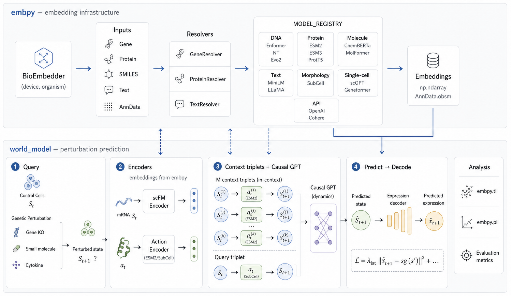
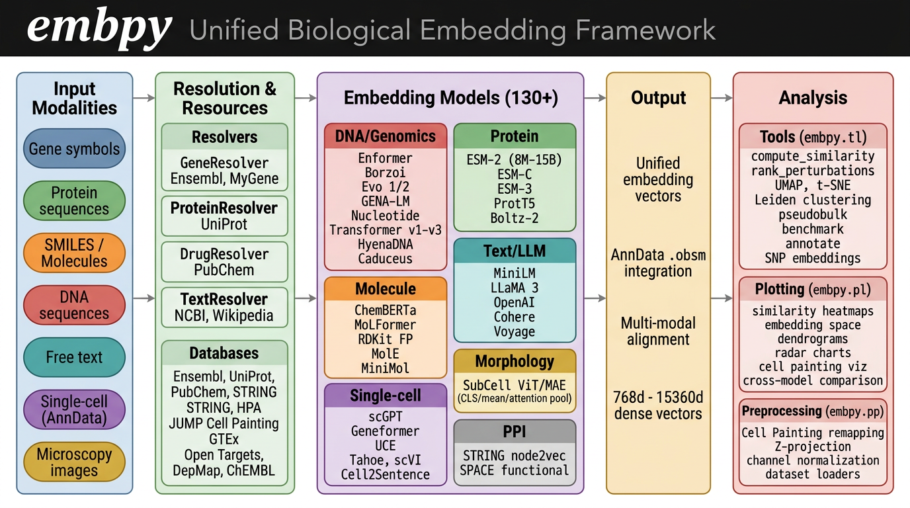
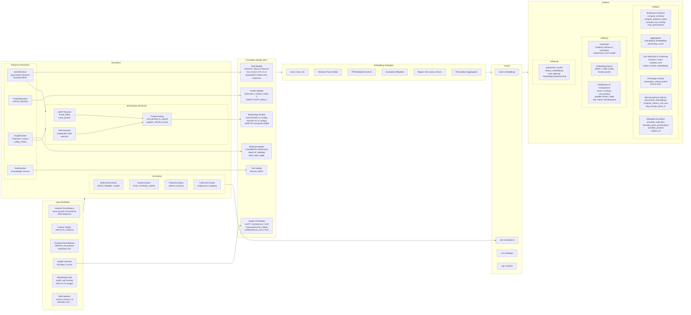

# embpy

[![Tests][badge-tests]][tests]
[![Documentation][badge-docs]][documentation]

[badge-tests]: https://img.shields.io/github/actions/workflow/status/grpinto/embpy/test.yaml?branch=main
[badge-docs]: https://img.shields.io/readthedocs/embpy

**embpy** is a Python package for generating embeddings of biological perturbations and cell lines using 130+ foundation models through a unified interface.

Given a perturbation (genetic, chemical, or morphological) and/or single-cell expression data, embpy resolves the underlying biological sequences and images, routes them to the appropriate foundation models, and returns dense vector representations ready for downstream machine learning.

<p align="center">
  
</p>

## Jump to what you need

| I want to&nbsp;...                          | Go to                                                                                   |
| ------------------------------------------- | --------------------------------------------------------------------------------------- |
| **Install** embpy (pixi / uv / conda / pip) | [Installation](#installation)                                                           |
| Run a **GPU notebook on the SLURM cluster** | [Running GPU JupyterLab on a SLURM cluster](#running-gpu-jupyterlab-on-a-slurm-cluster) |
| See **copy-paste code examples**            | [Quick Start](#quick-start)                                                             |
| Browse the **130+ models** and their keys   | [Available Models](#available-models)                                                   |
| Learn by **tutorial notebook**              | [Tutorials](#tutorials)                                                                 |
| Understand the **design / data flow**       | [Architecture](#architecture) · [Workflow](#workflow)                                   |
| Use the **perturbation world model**        | [Repository structure](#repository-structure)                                           |
| Fix an **install / GPU / import** problem   | [Troubleshooting](#troubleshooting)                                                     |

## Table of contents

- [Repository structure](#repository-structure) — the two packages (`embpy`, `world_model`)
    - [Cross-package import surface](#cross-package-import-surface)
    - [Install matrix](#install-matrix)
- [Workflow](#workflow)
- [Architecture](#architecture)
- [Key Features](#key-features)
- [Quick Start](#quick-start) — one runnable snippet per modality
    - [DNA](#embed-a-gene-with-a-dna-model) · [Protein](#embed-a-protein-with-esm-2) · [Molecule](#embed-a-small-molecule) · [FASTA](#embed-sequences-from-a-fasta-file) · [Cells (AnnData)](#embed-cells-from-an-anndata) · [Text](#text-knowledge-embeddings) · [Structure (Boltz-2)](#boltz-2-structure-embeddings) · [Morphology](#morphological-embeddings)
    - [Cell-line context](#cell-line-context-annotation) · [Annotate perturbations](#annotate-perturbations)
- [Available Models](#available-models)
    - [DNA](#dna-models) · [Protein](#protein-models) · [Molecule](#molecule-models) · [Single-Cell](#single-cell-foundation-models) · [Morphology](#morphology-models) · [Text](#text-models)
- [Installation](#installation)
    - [Pixi (recommended)](#option-1-pixi-recommended) · [uv](#option-2-uv) · [Conda / mamba](#option-3-conda--mamba) · [pip](#option-4-plain-pip)
    - [Running GPU JupyterLab on a SLURM cluster](#running-gpu-jupyterlab-on-a-slurm-cluster)
    - [Optional extras](#optional-extras) · [Verifying the installation](#verifying-the-installation) · [Troubleshooting](#troubleshooting)
- [Tutorials](#tutorials) — the numbered notebooks
- [Package Structure](#package-structure)
- [Release Notes](#release-notes) · [Contact](#contact) · [Citation](#citation)

## Repository structure

This repository hosts **two independent Python packages** under `src/`:

| Package       | Purpose                                                                                                                                                | Source path        | Install                                        |
| ------------- | ------------------------------------------------------------------------------------------------------------------------------------------------------ | ------------------ | ---------------------------------------------- |
| `embpy`       | Infrastructure: embeddings, resolvers, annotations, plotting, analysis, and foundation-model wrappers (130+ DNA / protein / RNA / cell / drug models). | `src/embpy/`       | `pip install embpy` (or `uv pip install -e .`) |
| `world_model` | Perturbation world model: state-stack encoder, gene-embedding action, GPT-style autoregressive dynamics, training / evaluation pipelines.              | `src/world_model/` | `pip install -e ./src/world_model`             |

`world_model` depends on `embpy`; the reverse is forbidden and enforced by `tests/embpy/test_boundary.py`. The name `world_model` may be renamed in a follow-up (candidates: `pertwm`, `pertworld`, `worldcell`).

### Cross-package import surface

Every `world_model -> embpy` boundary import is enumerated in `src/world_model/world_model/__init__.py` under the `# --- depends on embpy: ---` block. The current touch points are:

| Symbol                                                                          | Used by (in `world_model`)                                                                 |
| ------------------------------------------------------------------------------- | ------------------------------------------------------------------------------------------ |
| `embpy.resources.gene.control.ControlPolicy`                                    | `data/embeddings/{registry,bio_embedder,precomputed}.py`, `scripts/embed_perturbations.py` |
| `embpy.embedder.BioEmbedder` _(lazy)_                                           | `data/embeddings/bio_embedder.py` (`_get_embedder`)                                        |
| `embpy.models.singlecell_models.{StackWrapper, StateEmbeddingWrapper}` _(lazy)_ | `models/encoders/backbones/{stack, state}.py`                                              |

### Install matrix

Pixi (recommended for GPU / reproducible envs):

```bash
pixi install -e default                   # CPU env, both packages editable
pixi install -e mps                       # MacBook / Apple Silicon GPU via PyTorch MPS
pixi install -e gpu                       # GPU env (Linux + CUDA 12.4), both packages editable
pixi run -e gpu embpy-shell               # interactive shell, cwd=src/embpy/
pixi run -e gpu wm-shell                  # interactive shell, cwd=src/world_model/
```

uv (workspace-aware, lighter-weight):

```bash
uv sync --all-packages                    # resolve embpy + world_model together
uv sync --all-packages --extra all-cu124  # GPU build with CUDA 12.4 wheels
uv pip install -e ".[dev,doc]"            # editable dev install of embpy only
```

Plain pip (PyPI-only):

```bash
pip install embpy[all-cu124]              # embpy stack
pip install -e ./src/world_model[state,stack]   # world_model with both backbones
```

## Workflow

<p align="center">
  
</p>

## Architecture

<details>
<summary>Mermaid diagram (click to expand)</summary>


```mermaid
flowchart LR
    subgraph inputs [" Input Modalities "]
        direction TB
        GeneInput["Genetic Perturbations\nGene Symbol | Ensembl ID\nDNA Sequence"]
        ProtInput["Protein Targets\nUniProt ID | Isoforms"]
        MolInput["Chemical Perturbations\nSMILES | Drug Name\nPubChem CID"]
        CellInput["Single-Cell Data\nAnnData | Counts"]
        MorphInput["Morphology Data\nJUMP Cell Painting\nHPA ICC-IF Images"]
        SpeciesInput["Multi-Species\nhuman | mouse | rat\nzebrafish | fly | ..."]
    end

    subgraph resolution [" Resolution "]
        direction TB
        subgraph seq_res [Sequence Resolution]
            GeneRes["GeneResolver\npyensembl | MyGene\nEnsembl REST"]
            ProtRes["ProteinResolver\nUniProt | MyGene"]
            DrugRes["DrugResolver\nPubChem | Cactus\nCIRpy | RDKit"]
            TextRes["TextResolver\n6 knowledge sources"]
        end
        subgraph morph_res [Morphology Resolution]
            JUMPRes["JUMP Resolver\nbroad_babel\njump_portrait"]
            HPARes["HPA Resolver\nproteinatlas XML\nHPA API"]
            MorphPrep["Preprocessing\ncell_painting_to_subcell\nprepare_subcell_canvas"]
        end
        subgraph ann [Annotation]
            MolAnn["MoleculeAnnotator\nRDKit | ChEMBL | ChEBI"]
            GeneAnn["GeneAnnotator\nGTEx | STRING | GWAS"]
            ProtAnn["ProteinAnnotator\nUniProt | InterPro"]
            CellAnn["CellLineAnnotator\nCellosaurus | DepMap"]
        end
    end

    subgraph models [" Foundation Models (60+) "]
        direction TB
        DNA["DNA Models\nEnformer | Borzoi | Flashzoi\nEvo 1/1.5/2 | NT v1-v3\nHyenaDNA | GENA-LM | Caduceus"]
        Prot["Protein Models\nESM-1b/1v | ESM-2 | ESM-C\nESM3 | ProtT5 | Boltz-2"]
        Mol["Molecule Models\nChemBERTa | MolFormer\nRDKit FP | MiniMol\nMHG-GNN | MolE"]
        SC["Single-Cell Models\nscGPT | Geneformer | UCE\nTranscriptFormer | Tahoe\nCell2Sentence | scVI | PCA"]
        Morph["Morphology Models\nSubCell MAE (4 configs)\nSubCell ViT (4 configs)\nJUMP Pre-computed (259d)"]
        Text["Text Models\nMiniLM | BERT"]
    end

    subgraph strategies [" Embedding Strategies "]
        direction TB
        StdPool["mean | max | cls"]
        AttnPool["Attention Pool (1536d)"]
        TPMWeight["TPM-Weighted Isoform"]
        AnnWeight["Annotation-Weighted"]
        RegionEmb["Region: full | exons | introns"]
        PertAgg["Perturbation Aggregation"]
    end

    subgraph output [" Output "]
        direction TB
        ObsmOut[".obsm embeddings"]
        ObsOut[".obs annotations"]
        UnsOut[".uns metadata"]
        NpzOut[".npz matrices"]
    end

    subgraph analysis [" Analysis "]
        direction TB
        subgraph tl [embpy.tl]
            SimTL["Similarity & Distance\ncompute_similarity\ncompute_distance_matrix\ncompute_knn_overlap\nrank_perturbations"]
            AggTL["Aggregation\npseudobulk_embeddings\nphenocopy_score"]
            DimTL["Dim Reduction & Clustering\ncompute_umap | compute_tsne\nleiden | cluster_embeddings"]
            ActTL["Phenotypic Activity\nphenotypic_activity (mAP)\nCPU & GPU"]
            BenchTL["Benchmarking & Metrics\nbenchmark_embeddings\ncompute_metrics | cell_eval\ndeg_overlap | gene_r2"]
            MetaTL["Metadata Annotation\nannotate_molecules\nannotate_gene_perturbations\nannotate_proteins\nembed_vcf"]
        end
        subgraph pl [embpy.pl]
            HeatPL["Heatmaps\nsimilarity | distance | correlation\nclustermap | cross-model"]
            SpacePL["Embedding Space\nUMAP | t-SNE scatter\nfeature panels"]
            VisPL["Distributions & Comparisons\nnorms | ranking | cell_painting\nparallel coords | radar\nstar coords | dendrograms"]
        end
        subgraph pp [embpy.pp]
            PrepPP["preprocess_counts\nreduce_embeddings\nload_depmap\nmorphology preprocessing"]
        end
    end

    inputs --> resolution
    GeneRes --> DNA
    GeneRes --> morph_res
    ProtRes --> Prot
    DrugRes --> Mol
    DrugRes --> morph_res
    TextRes --> Text
    CellInput --> SC
    JUMPRes --> MorphPrep
    HPARes --> MorphPrep
    MorphPrep --> Morph

    models --> strategies
    ann --> ObsOut
    strategies --> output
    output --> analysis
```

</details>

## Key Features

- **130+ foundation models** across DNA, protein, molecule, single-cell, morphology, text, and PPI modalities
- **Unified `BioEmbedder` interface** -- one class to access all models with automatic sequence resolution
- **Multi-species support** -- embed and annotate genes from any Ensembl-supported organism (human, mouse, rat, zebrafish, fly, worm, yeast, ...) with automatic species-aware sequence resolution via Ensembl REST, UniProt, MyGene.info, and STRING-DB
- **`embed_adata()`** -- embed cells and perturbations together in a single call
- **Weighted protein embeddings** -- TPM-weighted isoform averaging, annotation-weighted residue pooling, expression-context concatenation
- **Text knowledge embeddings** -- `TextResolver` fetches descriptions from 6 public sources (MyGene, NCBI, Ensembl, UniProt, Wikipedia, PubChem); `embed_description()` resolves + embeds in one call
- **Boltz-2 structure embeddings** -- extract trunk representations (single per-residue + pairwise interaction features) from the Boltz-2 biomolecular foundation model
- **Multi-source annotation** -- `MoleculeAnnotator` (RDKit, ChEMBL, ChEBI, KEGG, PubChem), `GeneAnnotator` (MyGene, GTEx, STRING-DB, Open Targets, GWAS Catalog), `ProteinAnnotator` (UniProt functional metadata, InterPro domains), `CellLineAnnotator` (Cellosaurus, DepMap/CCLE, Cell Model Passports, Wikipedia)
- **20 visualization functions** in `embpy.pl` -- heatmaps, clustermaps, UMAP/t-SNE, parallel coordinates, radar charts, star coordinates, dendrograms, cross-model comparison
- **Morphology embeddings** -- SubCell MAE/ViT models for JUMP Cell Painting and HPA fluorescence images with 8 model variants across 4 channel configurations; `embed_morphological()` for single images, `embed_perturbation_morphology()` for perturbation-level embedding with automatic identifier resolution (`GeneResolver` for genes, `DrugResolver` for compounds), image fetching from CDN or local paths, preprocessing, and aggregation; pre-computed JUMP CellProfiler profiles also supported
- **Phenotypic activity (mAP)** -- memory-efficient chunked cosine similarity with optional GPU acceleration for computing mean average precision on large perturbation screens (e.g. 50K+ wells)
- **GPU acceleration** via rapids_singlecell for preprocessing, PCA, UMAP, neighbors, and Leiden

### Standardized embedding output

`BioEmbedder.embed(...)` is the standardized embedding I/O path. It accepts direct identifiers (`list`, tuple, NumPy array, pandas Series/DataFrame, AnnData) or CSV/TSV/Parquet input paths. Multi-column tables require `identifier_column=...`; AnnData identifiers can come from `.obs_names`, `.var_names`, `obs_column=...`, or `var_column=...`.

Canonical IDs are used as primary keys by default: Ensembl gene IDs for genes, canonical SMILES for molecules, UniProt accessions for proteins, and explicit input IDs for raw text/sequence entries. Original symbols, names, and input values are kept as aliases/metadata, not as primary keys.

Outputs are AnnData, scverse-friendly files, or metadata-rich payloads. File output defaults to compressed NPZ and writes a `<file>.meta.json` sidecar; pass `fmt="csv"` for a readable table or `fmt="zarr"` for a directory with the matrix in Zarr and metadata in attrs. Multiple model/entity outputs use deterministic keys that include entity type and model name; multiple files require an output directory. AnnData outputs never store generated embeddings in `.X`: gene/protein embeddings go to `.varm`, observation-like embeddings go to `.obsm`, perturbation/action embeddings can be stored entity-aligned in `.uns`, and standalone AnnData uses sparse placeholder `.X` only. `whole_genome=True` embeds genome-wide Ensembl genes for an explicit organism using the resolver/resource backend. `harmonize_dim=...` applies per-result PCA before export and records the PCA metadata. Use `show_progress=True` to enable tqdm progress bars.

### AnnData and Tables

Persistent outputs stay simple: AnnData for experiment-aligned matrices,
Parquet/CSV for reusable embedding tables, and NPZ for lightweight numeric
artifacts. AnnData remains the experiment container: `.X` and layers hold
expression/count-like data, `.obs`/`.var` hold experiment metadata, and
generated embeddings live in `.obsm`, `.varm`, or structured `.uns`
metadata.

For perturbation/action embeddings, the preferred embpy storage is
entity-aligned `.uns`: one row per unique perturbation, canonical ids, aliases,
model/provenance metadata, and the embedding matrix together. When a model needs
one vector per cell, materialize that table into `.obsm` as a derived matrix:

```python
payload = embedder.embed(
    ["TP53", "MYC"],
    entity_type="gene",
    model="esm2_650M",
    output="payload",
)

adata = embedder.embed(
    ["TP53", "MYC"],
    entity_type="gene",
    model="esm2_650M",
    target=adata,
    attach_to="uns",
    key="X_pert_esm2_650M",
)

from embpy.io import materialize_perturbation_obsm

materialize_perturbation_obsm(
    adata,
    embedding_key="X_pert_esm2_650M",
    perturbation_key="perturbation",
)
```

For perturbation world-model runs, training still consumes generic AnnData:
perturbation labels in `adata.obs[data.perturbation_key]`, the exact control
label in `data.control_label`, cell/state embeddings in `adata.obsm["X_state"]`
(or your chosen `data.state_obsm_key`), and the materialized action matrix in
`adata.obsm["X_pert_<name>"]`. `data.dataset` is just a run label, not a
dataset-specific loader.

```bash
pixi run -e gpu python -m world_model.scripts.embed_perturbations \
    --dataset replogle \
    --h5ad data/crispr_datasets/replogle/replogle_2022_k562_essential.h5ad \
    --model esm2_650M \
    --output runs/_cache/action_embeddings/replogle_esm2_650M.npz \
    --output-h5ad runs/_cache/action_h5ad/replogle_esm2_650M.h5ad \
    --obsm-key X_pert_esm2_650M
```

Training then consumes `data.state_obsm_key` and
`action_embedding.source="anndata_obsm"` / `action_embedding.obsm_key` from
that same AnnData, so all rows are indexed by observation metadata.

- **Batch processing** with SLURM array job scripts for full-genome embedding
- **scverse integration** -- AnnData-native throughout, compatible with scanpy/scvi-tools/pertpy

## Quick Start

### Embed a gene with a DNA model

```python
from embpy.embedder import BioEmbedder

embedder = BioEmbedder(device="auto")

# DNA embedding (resolves gene -> genomic sequence -> model)
emb = embedder.embed_gene("TP53", model="enformer_human_rough", pooling_strategy="mean")
print(emb.shape)  # (3072,)
```

### Embed a protein with ESM-2

```python
# Protein embedding (resolves gene -> UniProt sequence -> model)
emb = embedder.embed_gene("TP53", model="esm2_650M", pooling_strategy="mean")
print(emb.shape)  # (1280,)

# All isoforms
isoforms = embedder.embed_protein("TP53", model="esm2_650M", isoform="all")
for iso_id, emb in isoforms.items():
    print(f"  {iso_id}: {emb.shape}")
```

### Embed a small molecule

```python
emb = embedder.embed_molecule("CC(=O)OC1=CC=CC=C1C(=O)O", model="chemberta2MTR")
print(emb.shape)  # (768,)
```

### Embed sequences from a FASTA file

```python
# Embed all sequences from a FASTA/FASTQ file (plain or gzipped)
adata = embedder.embed_fasta("proteins.fasta", model="esm2_650M")
print(adata)           # AnnData with .obs metadata and .obsm embeddings
print(adata.obsm["X_esm2_650M"].shape)  # (n_sequences, 1280)

# DNA sequences auto-detected from character set
adata = embedder.embed_fasta("reads.fastq.gz", model="nt_v2_500m")

# Explicit seq_type when needed
adata = embedder.embed_fasta("ambiguous.fa", model="esm2_650M", seq_type="protein")
```

### Embed cells from an AnnData

```python
import anndata as ad

adata = ad.read_h5ad("perturbseq.h5ad")

result = embedder.embed_cells(
    adata,
    models=["pca", "scvi", "scgpt"],
    preprocessing="standard",
    n_pca_components=50,
    n_latent=30,
)
# result.obsm["X_pca"]   -> (n_cells, 50)
# result.obsm["X_scvi"]  -> (n_cells, 30)
# result.obsm["X_scgpt"] -> (n_cells, 512)
```

### Combined cell + perturbation embedding

```python
result = embedder.embed_adata(
    adata,
    cell_models=["pca", "scgpt"],
    perturbation_models=["esm2_650M"],
    perturbation_column="perturbation",
    perturbation_type="auto",
)
# Cell embeddings + perturbation embeddings side by side in .obsm
```

### Weighted perturbation embedding

```python
from embpy.tl import WeightedProteinEmbedder

wpe = WeightedProteinEmbedder(embedder)

# TPM-weighted isoform average
emb = wpe.embed_perturbation(
    "TP53", model="esm2_650M", strategy="tpm_weighted",
    tpm_values={"P04637": 45.2, "P04637-2": 12.8},
)

# Annotation-weighted: active/binding sites get 3x weight
emb = wpe.embed_perturbation(
    "TP53", model="esm2_650M", strategy="annotation_weighted",
    site_boost=3.0,
)
```

### Multi-species embedding

```python
# Mouse gene embeddings using Borzoi mouse weights
mouse_embedder = BioEmbedder(device="auto", organism="mouse")
emb = mouse_embedder.embed_gene("Trp53", model="borzoi_v0_mouse", pooling_strategy="mean")

# Cross-species protein comparison with ESM-2
human_embedder = BioEmbedder(device="auto", organism="human")
human_tp53 = human_embedder.embed_protein("TP53", model="esm2_650M")
mouse_trp53 = mouse_embedder.embed_protein("Trp53", model="esm2_650M")

# Mouse gene annotations (STRING PPI uses mouse taxon 10090)
from embpy.resources.gene_annotator import GeneAnnotator
mouse_ann = GeneAnnotator(organism="mouse")
ppi = mouse_ann.get_protein_interactions("Trp53")
```

### Text knowledge embeddings

```python
# Fetch descriptions from 6 knowledge sources and embed them
emb = embedder.embed_description("TP53", model="minilm_l6_v2")

# Inspect descriptions before embedding
from embpy.resources import TextResolver
tr = TextResolver(organism="human")
descs = tr.get_gene_description("BRCA1")
for source, text in descs.items():
    print(f"[{source}] {text[:100]}...")

# Embed custom text directly
emb = embedder.embed_text("TP53 is a tumor suppressor gene.", model="minilm_l6_v2")
```

### Boltz-2 structure embeddings

```python
# Single representation from Boltz-2 pairformer trunk (~384 dims)
emb = embedder.embed_protein("TP53", model="boltz2", pooling_strategy="mean")

# Pairwise interaction features (~128 dims)
emb_z = embedder.embed_protein("TP53", model="boltz2_pairwise")

# Both concatenated (~512 dims)
emb_both = embedder.embed_protein("TP53", model="boltz2_both")
```

### Morphological embeddings

```python
from embpy.embedder import BioEmbedder

embedder = BioEmbedder(device="auto")

# Single image embedding (4-channel array or path)
emb = embedder.embed_morphological(image_array, model="subcell_mae_rybg")
print(emb.shape)  # (1536,) with attention_pool

# Perturbation-level: average across all JUMP images for a gene
emb = embedder.embed_perturbation_morphology(
    "PLK1", perturbation_type="genetic", dataset="jump",
    source="subcell", aggregate="mean", max_images=5,
)

# Compound perturbation (DrugResolver resolves name variants automatically)
emb = embedder.embed_perturbation_morphology(
    "Latrunculin B", perturbation_type="compound", dataset="jump",
)

# HPA gene embedding (GeneResolver maps symbol -> Ensembl ID)
emb = embedder.embed_perturbation_morphology(
    "TP53", perturbation_type="genetic", dataset="hpa",
)

# Pre-computed JUMP CellProfiler profiles (no GPU needed)
emb = embedder.embed_perturbation_morphology(
    "PLK1", source="precomputed", dataset="jump",
)
print(emb.shape)  # (259,) CellProfiler features
```

### Cell line context annotation

```python
from embpy.resources import CellLineAnnotator

ann = CellLineAnnotator()
info = ann.annotate("A549")
# {'tissue': 'Lung', 'disease': 'Non-small cell lung carcinoma', 'lineage': 'Lung', ...}

# Text embedding of cell line context (metadata + Wikipedia)
emb = embedder.embed_description("HeLa", entity_type="cellline", model="minilm_l6_v2")

# Annotate cell lines in an AnnData
adata = ann.annotate_adata(adata, column="cell_line")
# Adds cellline_tissue, cellline_disease, cellline_lineage to .obs
```

### Annotate perturbations

```python
from embpy.tl import annotate_molecules, annotate_gene_perturbations, annotate_proteins

# Molecule annotations (physicochemical, bioactivities, pathways, diseases)
adata = annotate_molecules(adata, column="drug_name")

# Gene annotations (pathways, tissue expression, PPI, diseases)
adata = annotate_gene_perturbations(adata, column="gene")

# Protein annotations (UniProt function, domains, PTMs, GO terms)
adata = annotate_proteins(adata, column="gene")
```

## Available Models

### DNA Models

| Model                        | Key                                            | Parameters   |
| ---------------------------- | ---------------------------------------------- | ------------ |
| Enformer                     | `enformer_human_rough`                         | 250M         |
| Borzoi (4 replicates)        | `borzoi_v0` -- `borzoi_v3`                     | 200M         |
| Borzoi Mouse                 | `borzoi_v0_mouse` -- `borzoi_v3_mouse`         | 200M         |
| Flashzoi (4 replicates)      | `flashzoi_v0` -- `flashzoi_v3`                 | 200M         |
| Evo 1 / 1.5                  | `evo1_8k`, `evo1_131k`, `evo1.5_8k`            | 7B           |
| Evo 2                        | `evo2_7b`, `evo2_40b`                          | 7B / 40B     |
| Nucleotide Transformer v1/v2 | `nt_500m_human_ref`, `nt_v2_500m`, ...         | 50M -- 2.5B  |
| Nucleotide Transformer v3    | `ntv3_100m_pre`, `ntv3_650m_pos`, ...          | 8M -- 650M   |
| HyenaDNA                     | `hyenadna_tiny_1k` -- `hyenadna_large_1m`      | 1.6M -- 6.6M |
| GENA-LM                      | `gena_lm_bert_base`, `gena_lm_bert_large`, ... | 110M -- 336M |
| Caduceus                     | `caduceus_ph_131k`, `caduceus_ps_131k`         | 16M          |

### Protein Models

| Model            | Key                                        | Parameters    |
| ---------------- | ------------------------------------------ | ------------- |
| ESM-1b           | `esm1b`                                    | 650M          |
| ESM-1v (5 seeds) | `esm1v_1` -- `esm1v_5`                     | 650M          |
| ESM-2            | `esm2_8M` -- `esm2_15B`                    | 8M -- 15B     |
| ESM-C            | `esmc_300m`, `esmc_600m`, `esmc_6b`        | 300M -- 6B    |
| ESM3             | `esm3_small`, `esm3_medium`, `esm3_large`  | 1.4B -- 98B   |
| ProtT5           | `prot_t5_xl`, `prot_t5_xl_half`            | 3B            |
| Boltz-2          | `boltz2`, `boltz2_pairwise`, `boltz2_both` | ~400M (trunk) |

### Molecule Models

| Model              | Key                                      | Type              |
| ------------------ | ---------------------------------------- | ----------------- |
| ChemBERTa          | `chemberta2MTR`, `chemberta2MLM`         | Transformer       |
| MolFormer          | `molformer_base`                         | Transformer       |
| RDKit Fingerprints | `rdkit_fp`, `morgan_fp`, `maccs_fp`, ... | Classical         |
| MiniMol            | `minimol`                                | GNN               |
| MHG-GNN            | `mhg_gnn`                                | Hypergraph GNN    |
| MolE               | `mole`                                   | Graph Transformer |

### Single-Cell Foundation Models

| Model                   | Key                                                    | Parameters   |
| ----------------------- | ------------------------------------------------------ | ------------ |
| scGPT                   | `scgpt`                                                | 51M          |
| Geneformer v1/v2        | `geneformer_v1_6L` -- `geneformer_v2_18L`              | 10M -- 316M  |
| UCE                     | `uce`                                                  | 1.3B         |
| TranscriptFormer        | `transcriptformer_metazoa`, `transcriptformer_sapiens` | 368M -- 542M |
| Tahoe-x1                | `tahoe_70m`, `tahoe_1b`, `tahoe_3b`                    | 70M -- 3B    |
| Cell2Sentence-Scale     | `cell2sentence_2b`, `cell2sentence_27b`                | 2B -- 27B    |
| PCA                     | `pca`                                                  | --           |
| scVI / scANVI / totalVI | `scvi`, `scanvi`, `totalvi`                            | --           |

### Morphology Models

| Model                     | Key                | Channels             |
| ------------------------- | ------------------ | -------------------- |
| SubCell MAE (all)         | `subcell_mae_rybg` | MT, ER, DNA, Protein |
| SubCell ViT (all)         | `subcell_vit_rybg` | MT, ER, DNA, Protein |
| SubCell MAE (MT-DNA-Prot) | `subcell_mae_rbg`  | MT, DNA, Protein     |
| SubCell ViT (MT-DNA-Prot) | `subcell_vit_rbg`  | MT, DNA, Protein     |
| SubCell MAE (ER-DNA-Prot) | `subcell_mae_ybg`  | ER, DNA, Protein     |
| SubCell ViT (ER-DNA-Prot) | `subcell_vit_ybg`  | ER, DNA, Protein     |
| SubCell MAE (DNA-Prot)    | `subcell_mae_bg`   | DNA, Protein         |
| SubCell ViT (DNA-Prot)    | `subcell_vit_bg`   | DNA, Protein         |

### Text Models

| Model  | Key                 |
| ------ | ------------------- |
| MiniLM | `minilm_l6_v2`      |
| BERT   | `bert_base_uncased` |

## Installation

Requires **Python 3.11+**. Installing embpy means pulling in PyTorch,
RDKit, pysam, HuggingFace transformers, and a long tail of model-specific
packages -- historically this has been the single biggest friction point
for new users. We now ship three supported install paths, ordered from
_most reproducible_ to _most familiar_:

| Path                                                 | When to use                                                                                                     |
| ---------------------------------------------------- | --------------------------------------------------------------------------------------------------------------- |
| **[Pixi](#option-1-pixi-recommended)** (recommended) | You want _one command_ that works. Lockfile-backed, cross-platform, handles CUDA + RDKit + pysam automatically. |
| **[uv](#option-2-uv)**                               | You already manage envs with venv/virtualenv and just want something 10-100x faster than pip.                   |
| **[Conda / mamba](#option-3-conda--mamba)**          | You're on an HPC cluster with existing conda tooling.                                                           |
| **[pip](#option-4-plain-pip)**                       | Fallback. Works but you'll need to juggle the torch CUDA index yourself.                                        |

> **TL;DR** -- on a fresh machine:
>
> ```bash
> curl -fsSL https://pixi.sh/install.sh | bash
> git clone https://github.com/theislab/embpy.git && cd embpy
> pixi install              # CPU (default)
> pixi shell                # activate
> pixi run verify           # smoke test
>
> # Apple Silicon / MacBook GPU
> pixi install -e mps
> pixi run -e mps verify-mps
> pixi run -e mps install-kernel-mps
> pixi run -e mps jupyter --port 8888
> ```

---

### Option 1: Pixi (recommended)

[Pixi](https://pixi.sh) gives you a **lockfile-backed, reproducible**
environment across Linux / macOS (Apple Silicon + Intel). It mixes
conda-forge (for the binary-heavy packages: PyTorch, RDKit, pysam,
pyarrow) with PyPI (for everything pure-Python), which is exactly the
combination that has historically been painful to set up by hand.

```bash
# 1. install pixi (one-time, ~15 MB)
curl -fsSL https://pixi.sh/install.sh | bash

# 2. clone and install
git clone https://github.com/theislab/embpy.git
cd embpy

# CPU install (default env)
pixi install
pixi shell                    # activate
pixi run verify               # smoke-test

# Apple Silicon / MacBook GPU (PyTorch MPS backend)
pixi install -e mps
pixi shell -e mps
pixi run -e mps verify-mps

# GPU install (CUDA 12.4)
pixi install -e gpu
pixi shell -e gpu
pixi run verify
```

Pre-defined environments (switch with `pixi shell -e <name>`):

| Env           | Contents                                                                                                                                                                                                                                    |
| ------------- | ------------------------------------------------------------------------------------------------------------------------------------------------------------------------------------------------------------------------------------------- |
| `default`     | CPU PyTorch + core embpy + scanpy + morphology + jupyter                                                                                                                                                                                    |
| `mps`         | Apple Silicon PyTorch MPS backend + core embpy + scanpy + morphology + jupyter                                                                                                                                                              |
| `gpu`         | CUDA 12.4 PyTorch + pertpy + lamindb + ppi + jupyter                                                                                                                                                                                        |
| `helical-gpu` | Standalone env with `helical` (single-cell FMs) on GPU. Lives in its own solve-group with conda pins for `scipy==1.13.1`, `transformers==4.49.0`, `pandas==2.2.2`, `numpy<2`; **does not include ESM-3** (incompatible `transformers` pin). |
| `helical-cpu` | Same as `helical-gpu` but CPU only                                                                                                                                                                                                          |
| `dev`         | CPU + test + lint + docs tooling (for contributing)                                                                                                                                                                                         |
| `docs`        | CPU + Sphinx toolchain (`pixi run -e docs build-docs`)                                                                                                                                                                                      |

Common tasks (run with `pixi run <task>`):

| Task                        | What it does                                             |
| --------------------------- | -------------------------------------------------------- |
| `verify`                    | Smoke-test the install on CPU                            |
| `jupyter`                   | Launch JupyterLab on `0.0.0.0` (any port / ip via args)  |
| `install-kernel`            | Register this env as a `Python (embpy)` Jupyter kernel   |
| `-e mps verify-mps`         | Smoke-test Apple Silicon MPS visibility                  |
| `-e mps install-kernel-mps` | Register the MPS env as `Python (embpy-mps)`             |
| `-e gpu verify-gpu`         | Smoke-test the GPU install (needs a visible CUDA device) |
| `-e gpu install-kernel-gpu` | Register the GPU env as `Python (embpy-gpu)`             |

### Running notebooks locally

For the standard notebooks in `docs/notebooks`, use Pixi's Jupyter task:

```bash
pixi install -e mps                 # or: pixi install -e dev
pixi run -e mps install-kernel-mps  # one-time kernel registration
pixi run -e mps jupyter --port 8888
```

Then open the printed local URL and select the `Python (embpy-mps)` kernel.
If you do not need the Mac GPU, the same flow works with the default/dev env:

```bash
pixi run -e dev install-kernel
pixi run -e dev jupyter --port 8888
```

Inside a notebook you can check the active accelerator with:

```python
import torch

torch.backends.mps.is_available()
```

To run a local world-model action-embedding sweep on the MacBook GPU:

```bash
# quick local profile: Nadig/Replogle 80/20 within-dataset runs across
# the available MPS-safe action embeddings
pixi run -e mps wm-sweep-mps

# dry-run first: prints the planned commands without importing torch or training
DRYRUN=1 EMBEDDINGS=minilm_l6_v2 pixi run -e mps wm-sweep-mps

# single-dataset smoke test
DATASETS=replogle EMBEDDINGS="esm2_650M minilm_l6_v2" EPOCHS=1 pixi run -e mps wm-sweep-mps

# override local dataset paths without editing the launcher
NADIG_H5AD=/path/to/nadig.h5ad REPLOGLE_H5AD=/path/to/replogle.h5ad pixi run -e mps wm-sweep-mps

# full-size profile
PROFILE=full pixi run -e mps wm-sweep-mps
```

The MPS launcher writes runs under `runs/world_model/mps_action_sweep/`.
It uses the shared world-model run matrix in
`world_model.configs.run_matrix`, so local MPS sweeps and SLURM submitters use
the same dataset defaults and action-embedding catalog. The canonical launcher path is
`src/world_model/world_model/scripts/local/run_embedding_sweep_mps.sh`; the old
`scripts/run_embedding_sweep_mps.sh` path remains as a compatibility wrapper.

### Running GPU JupyterLab on a SLURM cluster

A ready-to-use SLURM launcher lives at
[`submission_scripts/jupyter_pixi.sbatch`](submission_scripts/jupyter_pixi.sbatch).
Unlike the old conda-based script, it does **not** need any
`LD_LIBRARY_PATH` hacks -- conda-forge's `pytorch-cuda` handles all of
that automatically.

```bash
# One-time, on the login node:
cd /path/to/embpy
pixi install -e gpu            # resolves + downloads ~1 GB once

# Every time you want a GPU notebook:
sbatch submission_scripts/jupyter_pixi.sbatch
cat slurm_jupyter_<JOBID>.txt  # token, host, port, SSH tunnel command
```

> **Note.** A few foundation models (Boltz-2, Evo 2, Caduceus, Arc
> STATE/STACK) pin dependencies that conflict with the main `gpu` stack
> (e.g. Boltz-2 requires `numpy<2.0`). They do **not** install into `gpu`
> via `pip install "embpy[...]"` — each lives in its **own pixi env** with
> a dedicated launcher. See
> [Models that need their own pixi env](#models-that-need-their-own-pixi-env)
> below.

#### Single-cell foundation models: a separate pixi env

Notebook [`08_singlecell_foundation_models.ipynb`](docs/notebooks/08_singlecell_foundation_models.ipynb)
uses the [helical](https://github.com/helicalAI/helical) package to load
scGPT, Geneformer, UCE, TranscriptFormer, Tahoe-x1 and Cell2Sentence.
Helical has a large set of rigid transitive dependencies
(`datasets==3.6.0`, `scib`, `loompy`, `mamba-ssm`, ...) that force older
`numpy`, `pandas`, `fsspec`, `dill` and `torch` versions than the main
`gpu` env uses. Mixing them in a single resolver run fails every time, so
helical lives in its own pixi environment: **`helical-gpu`**.

Consequently, notebook 12 must be run from a different JupyterLab server
than every other notebook in the repo. The repo ships a dedicated SLURM
launcher,
[`submission_scripts/jupyter_pixi_helical.sbatch`](submission_scripts/jupyter_pixi_helical.sbatch),
that activates `helical-gpu` instead of `gpu`.

```bash
# One-time, on the login node. CONDA_OVERRIDE_CUDA tells the solver to
# pick CUDA-enabled pytorch variants even when the login node itself is
# CPU-only. The compute node it actually runs on has a real GPU.
cd /path/to/embpy
CONDA_OVERRIDE_CUDA=12.0 pixi install -e helical-gpu

# Every time you want to run notebook 12:
sbatch submission_scripts/jupyter_pixi_helical.sbatch
cat submission_scripts/logs/jupyter_pixi_helical_<JOBID>.out  # URL + token
```

All other notebooks (DNA, protein, molecule, morphology, identifier
handling, ...) run in the default `gpu` env via
`jupyter_pixi.sbatch`. If you're not touching notebook 12, you can
ignore `helical-gpu` entirely.

#### Models that need their own pixi env

Some foundation models hard-pin dependencies that cannot coexist with the
main `gpu` stack, so each gets a dedicated pixi environment **and** a
matching SLURM JupyterLab launcher. Install the env once, then submit its
launcher and connect exactly like `jupyter_pixi.sbatch`.

| Models / notebook                | Why isolated                          | Install once                                           | Launcher                                                                        |
| -------------------------------- | ------------------------------------- | ------------------------------------------------------ | ------------------------------------------------------------------------------- |
| **Boltz-2** (`boltz2*`) — nb 04  | pins `numpy<2.0`, `scipy==1.13.1`     | `pixi install -e boltz`                                | [`jupyter_pixi_boltz.sbatch`](submission_scripts/jupyter_pixi_boltz.sbatch)     |
| **Evo 2** (`evo2_*`)             | FlashAttn/CUDA build pins             | `pixi install -e evo2`                                 | [`jupyter_pixi_evo2.sbatch`](submission_scripts/jupyter_pixi_evo2.sbatch)       |
| **Arc STATE/STACK** — nb 08 §13c | `pytorch>=2.7`, `scipy>=1.15`         | `CONDA_OVERRIDE_CUDA=12.0 pixi install -e arc-gpu`     | [`jupyter_pixi_arc.sbatch`](submission_scripts/jupyter_pixi_arc.sbatch)         |
| **helical** scFMs — nb 08        | `transformers==4.49`, `scipy==1.13.1` | `CONDA_OVERRIDE_CUDA=12.0 pixi install -e helical-gpu` | [`jupyter_pixi_helical.sbatch`](submission_scripts/jupyter_pixi_helical.sbatch) |
| **Caduceus** (`caduceus_*`)      | needs `mamba-ssm` (CUDA nvcc)         | `pixi install -e caduceus`                             | run via `pixi run -e caduceus`                                                  |

```bash
# Example: Boltz-2 structure embeddings (notebook 04)
pixi install -e boltz                              # one-time
sbatch submission_scripts/jupyter_pixi_boltz.sbatch
cat submission_scripts/logs/jupyter_pixi_boltz_<JOBID>.out   # URL + token
# In the notebook, pick the kernel from the `boltz` server, NOT the gpu one.
```

The "Boltz not installed" message in notebook 04 simply means the notebook
is running on a kernel from a different env (e.g. `gpu`); launch it from the
`boltz` server above instead.

---

### Option 2: uv

[uv](https://docs.astral.sh/uv/) is a 10-100x faster drop-in replacement
for pip. Thanks to the `[tool.uv]` block in `pyproject.toml`, you do
**not** have to remember `--extra-index-url` for the right CUDA wheel --
uv picks it up automatically from the extra you select.

```bash
# install uv (one-time)
curl -LsSf https://astral.sh/uv/install.sh | sh

# Clone and sync
git clone https://github.com/theislab/embpy.git
cd embpy

# CPU install
uv sync --extra all-cpu

# GPU install (CUDA 12.4)
uv sync --extra all-cu124

# Development install (editable, with tests + docs)
uv sync --extra dev --extra test --extra doc

# Activate the uv-managed env
source .venv/bin/activate
```

You can also install directly from GitHub without cloning:

```bash
uv pip install "embpy[all-cu124] @ git+https://github.com/theislab/embpy.git@main"
```

---

### Option 3: Conda / mamba

```bash
git clone https://github.com/theislab/embpy.git
cd embpy

# GPU environment (CUDA 12.4)
mamba env create -f environment.yml
mamba activate embpy

# -- or -- CPU-only environment
mamba env create -f environment-cpu.yml
mamba activate embpy-cpu
```

Both files install PyTorch, RDKit, pysam and the scientific stack from
conda-forge / pytorch / bioconda (pre-built binaries, no compilation),
then install embpy and its Python-only dependencies via pip. Optional
extras can be added any time:

```bash
pip install ".[helical]"    # single-cell foundation models
pip install ".[pertpy]"     # pertpy metadata annotation
pip install ".[boltz]"      # Boltz-2 (needs CUDA)
pip install ".[caduceus]"   # mamba-ssm (needs CUDA nvcc)
```

---

### Option 4: Plain pip

Works, but you are responsible for matching PyTorch to your CUDA
toolkit and for compiling binary deps (`pysam`, `rdkit`, ...) yourself.

```bash
# CPU
pip install "embpy[all-cpu] @ git+https://github.com/theislab/embpy.git@main"

# GPU (CUDA 12.4)
pip install "embpy[all-cu124] @ git+https://github.com/theislab/embpy.git@main" \
  --extra-index-url https://download.pytorch.org/whl/cu124
```

---

### Optional extras

Mix and match beyond the default install:

| Extra        | What it enables                                                                                                                                | Install path                                       |
| ------------ | ---------------------------------------------------------------------------------------------------------------------------------------------- | -------------------------------------------------- |
| _(base)_     | DNA (GENA-LM, NT v1/v2/v3, HyenaDNA, Borzoi, Enformer), Protein (ESM-1/2, ProtT5), Molecule (ChemBERTa, MolFormer, RDKit), text, PPI resolvers | pip / uv / pixi                                    |
| `ppi`        | PPI GNN encoder                                                                                                                                | pip / uv / pixi                                    |
| `pertpy`     | pertpy metadata annotation                                                                                                                     | pip / uv / pixi                                    |
| `lamindb`    | LaminDB dataset loading                                                                                                                        | pip / uv / pixi                                    |
| `scanpy`     | scanpy integration                                                                                                                             | pip / uv / pixi                                    |
| `morphology` | Cell Painting image preprocessing (Pillow)                                                                                                     | pip / uv / pixi                                    |
| `ntv3`       | Nucleotide Transformer v3 (needs transformers >= 5.0)                                                                                          | pip / uv / pixi                                    |
| `all`        | All extras above that install cleanly via pure pip/uv                                                                                          | pip / uv / pixi                                    |
| `all-cpu`    | `all` + CPU PyTorch                                                                                                                            | pip / uv / pixi                                    |
| `all-cu121`  | `all` + CUDA 12.1 PyTorch                                                                                                                      | pip / uv / pixi                                    |
| `all-cu124`  | `all` + CUDA 12.4 PyTorch                                                                                                                      | pip / uv / pixi                                    |
| `all-cu128`  | `all` + CUDA 12.8 PyTorch                                                                                                                      | pip / uv / pixi                                    |
| `esm3`       | ESM-3 / ESM-C (pins `transformers<4.48.2`, cannot coexist with `helical`)                                                                      | pip / uv / pixi (own env)                          |
| `helical`    | Single-cell foundation models (scGPT, Geneformer, UCE, Tahoe, Cell2Sentence) -- transitively needs the `igraph` C library                      | **conda / pixi only** (pixi `gpu` env includes it) |
| `minimol`    | MiniMol molecule GNN (needs pre-built `torch-sparse`, `torch-scatter`)                                                                         | **conda / pixi only**                              |
| `evo`        | Evo v1 / v1.5                                                                                                                                  | pip (slow) / pixi                                  |
| `evo2`       | Evo 2                                                                                                                                          | **conda / pixi** (needs CUDA)                      |
| `caduceus`   | Caduceus (mamba-ssm, **requires CUDA nvcc**)                                                                                                   | **conda / pixi**                                   |
| `boltz`      | Boltz-2 structure embeddings (**requires CUDA**, pins `numpy<2`)                                                                               | separate env only                                  |

---

### Verifying the installation

```python
from embpy.embedder import BioEmbedder

embedder = BioEmbedder(device="auto")
print(f"Device: {embedder.device}")
print(f"Models: {len(embedder.list_available_models())} available")
```

Or as a shell one-liner (works inside any of the envs above):

```bash
pixi run verify               # pixi users
python -c "from embpy.embedder import BioEmbedder; e=BioEmbedder(device='cpu'); print('ok', e.device, len(e.list_available_models()))"
```

---

### Troubleshooting

Three issues account for **the vast majority** of install problems. If
any of these look familiar, start here:

<details>
<summary><b><code>AttributeError: _ARRAY_API not found</code> / "compiled using NumPy 1.x cannot be run in NumPy 2.x"</b></summary>

This means `pyarrow` (or another compiled package) was built against
NumPy 1.x but your environment has NumPy 2.x. The usual cause is a
leftover install in `~/.local/lib/python3.12/site-packages` shadowing
your env.

```bash
# Inside your activated env:
pip install --upgrade "pyarrow>=15" "numpy>=1.26,<3"

# And force Python to ignore user-site-packages:
export PYTHONNOUSERSITE=1
```

For Jupyter, add `"env": {"PYTHONNOUSERSITE": "1"}` (and `-s` to the
python `argv`) in your kernel's `kernel.json`. The pixi / conda envs
shipped here set this automatically.

</details>

<details>
<summary><b><code>error: Failed building wheel for rdkit / pysam / mamba-ssm</code></b></summary>

Plain pip tries to compile these from source. Don't -- use conda-forge
or pixi instead, where they come as pre-built binaries:

```bash
# pixi (recommended)
pixi install

# or conda/mamba
mamba install -c conda-forge rdkit "pysam>=0.22"
```

`mamba-ssm` (needed by the `caduceus` extra) also needs `nvcc` from a
matching CUDA toolkit:

```bash
pip install mamba-ssm --no-build-isolation
```

</details>

<details>
<summary><b>torch installed CPU-only when I wanted CUDA (or vice-versa)</b></summary>

PyTorch ships different wheels per CUDA version on a _separate_ index
(`https://download.pytorch.org/whl/cuXXX`). If you use pixi or uv with
the `all-cu124` extra, the correct wheel is picked automatically. With
plain pip you must pass `--extra-index-url`:

```bash
pip install "embpy[all-cu124]" \
  --extra-index-url https://download.pytorch.org/whl/cu124
```

Verify with:

```python
import torch
print(torch.__version__, torch.cuda.is_available(), torch.version.cuda)
```

</details>

<details>
<summary><b>Install is very slow</b></summary>

Plain pip's dependency resolver can take several minutes on an env this
size. Switch to uv or pixi:

```bash
# uv -- parallel downloads, fast resolver
uv sync --extra all-cu124

# pixi -- solve once, reuse lockfile forever
pixi install
```

</details>

## Tutorials

| #   | Topic                                                                      | Notebook                                                                                        |
| --- | -------------------------------------------------------------------------- | ----------------------------------------------------------------------------------------------- |
| 01  | Identifiers, Resolvers & Data Loading                                      | [01_identifiers_and_preprocessing.ipynb](docs/notebooks/01_identifiers_and_preprocessing.ipynb) |
| 02  | Gene & DNA Embeddings                                                      | [02_gene_embeddings.ipynb](docs/notebooks/02_gene_embeddings.ipynb)                             |
| 03  | Protein Embeddings                                                         | [03_protein_embeddings.ipynb](docs/notebooks/03_protein_embeddings.ipynb)                       |
| 04  | Boltz-2 Structure Embeddings                                               | [04_boltz2_structure_embeddings.ipynb](docs/notebooks/04_boltz2_structure_embeddings.ipynb)     |
| 05  | Molecule (Drug) Embeddings                                                 | [05_molecule_embeddings.ipynb](docs/notebooks/05_molecule_embeddings.ipynb)                     |
| 06  | Text Embeddings                                                            | [06_text_embeddings.ipynb](docs/notebooks/06_text_embeddings.ipynb)                             |
| 07  | PPI Network Embeddings                                                     | [07_ppi_embeddings.ipynb](docs/notebooks/07_ppi_embeddings.ipynb)                               |
| 08  | Single-Cell Foundation Model Embeddings                                    | [08_singlecell_foundation_models.ipynb](docs/notebooks/08_singlecell_foundation_models.ipynb)   |
| 09  | JUMP Cell Painting Morphological Embeddings                                | [09_morphology_jump_cell_painting.ipynb](docs/notebooks/09_morphology_jump_cell_painting.ipynb) |
| 10  | Annotation & Entity Context (genes, proteins, molecules, cell lines, text) | [10_annotation_and_context.ipynb](docs/notebooks/10_annotation_and_context.ipynb)               |
| 11  | Cross-Species Ortholog Embeddings                                          | [11_cross_species_embeddings.ipynb](docs/notebooks/11_cross_species_embeddings.ipynb)           |
| 12  | Unified Embedding with embed_adata                                         | [12_unified_embedding.ipynb](docs/notebooks/12_unified_embedding.ipynb)                         |
| 13  | DepMap Cancer Dependency Analysis                                          | [13_depmap_analysis.ipynb](docs/notebooks/13_depmap_analysis.ipynb)                             |

## Package Structure

```
embpy/
    embedder.py          # BioEmbedder(organism=...) -- unified multi-species embedding
    models/
        dna_models.py    # Enformer, Borzoi, Evo, NT, HyenaDNA, Caduceus, GENA-LM
        protein_models.py # ESM-2, ESM-C, ESM3, ProtT5
        molecule_models.py # ChemBERTa, MolFormer, RDKit, MiniMol, MHG-GNN, MolE
        singlecell_models.py # scGPT, Geneformer, UCE, PCA, scVI
        morphology_models.py # SubCell MAE/ViT for JUMP Cell Painting
        structure_models.py  # Boltz-2 trunk embeddings
    resources/
        gene_resolver.py      # Multi-species gene resolution (Ensembl, MyGene)
        protein_resolver.py   # Multi-species protein resolution (UniProt, MyGene)
        drug_resolver.py      # Drug name <-> SMILES resolution (PubChem, Cactus, CIRpy)
        text_resolver.py      # Text descriptions from 6 knowledge sources
        molecule_annotator.py # Small molecule annotations (6 sources)
        gene_annotator.py     # Gene annotations (pathways, PPI, diseases -- species-aware)
        protein_annotator.py  # Protein annotations (UniProt, InterPro -- species-aware)
        cellline_annotator.py # Cell line context (Cellosaurus, DepMap, Passports, Wikipedia)
        jump_metadata.py      # JUMP Cell Painting metadata, gene/compound mapping, FOV fetch
        hpa_images.py         # HPA subcellular ICC-IF image fetch, catalog, antibody lookup
    pp/
        sc_preprocessing.py   # Single-cell preprocessing (raw/standard pipelines)
        morphology_preprocessing.py  # Cell Painting channel remapping, SubCell canvas prep
        basic.py              # Perturbation embedding matrix construction
    pl/
        embedding_space.py    # UMAP/t-SNE scatter, all_embeddings, feature panels
        heatmaps.py           # Similarity, distance, correlation, clustermap heatmaps
        clustering.py         # Leiden overview, composition, dendrogram
        distributions.py      # Embedding distributions, norms, perturbation ranking
        comparisons.py        # Parallel coordinates, radar charts, star coordinates
        cell_painting.py      # Cell Painting channel-coloured fluorescence visualization
        benchmark.py          # Benchmark result plots and comparisons
    tl/
        similarity.py         # Cosine/Pearson/Spearman similarity, KNN overlap, pseudobulk
        activity.py           # Phenotypic activity (mAP) with chunked cosine, CPU/GPU
        dimred.py             # UMAP, t-SNE (CPU/GPU)
        clustering.py         # Leiden, k-means, spectral (CPU/GPU)
        weighted_protein_embedding.py # TPM-weighted, annotation-weighted, expression-context
        metrics.py            # Benchmarking metrics, DEG overlap, phenocopy score
        benchmark.py          # Cross-validated regression benchmarks
        pipeline.py           # Automated evaluation pipelines
        metadata.py           # pertpy-based metadata annotation
        snp_utils.py          # SNP context extraction, VCF embedding
```

## Release Notes

See the [changelog][].

## Contact

For questions and help requests, you can reach out in the [scverse discourse][].
If you found a bug, please use the [issue tracker][].

## Citation

> t.b.a

[mambaforge]: https://github.com/conda-forge/miniforge#mambaforge
[scverse discourse]: https://discourse.scverse.org/
[issue tracker]: https://github.com/theislab/embpy/issues
[tests]: https://github.com/theislab/embpy/actions/workflows/test.yml
[documentation]: https://embpy.readthedocs.io
[changelog]: https://embpy.readthedocs.io/en/latest/changelog.html
[api documentation]: https://embpy.readthedocs.io/en/latest/api.html
