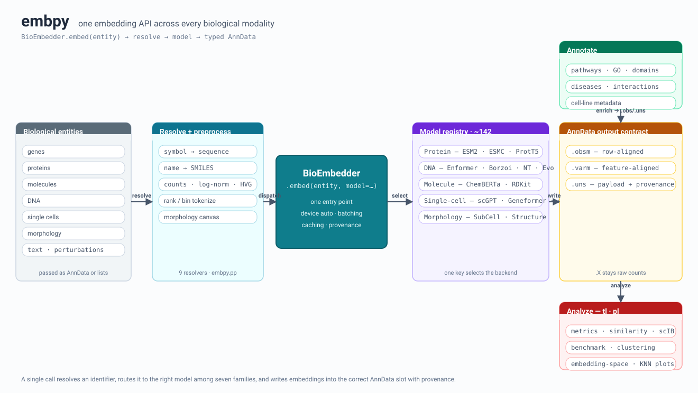

# embpy

[![Tests][badge-tests]][tests]
[![Documentation][badge-docs]][documentation]

[badge-tests]: https://img.shields.io/github/actions/workflow/status/theislab/embpy/test.yaml?branch=main
[badge-docs]: https://img.shields.io/readthedocs/embpy
[tests]: https://github.com/theislab/embpy/actions/workflows/test.yaml
[documentation]: https://embpy.readthedocs.io/

**embpy** is a Python toolkit for generating biological embeddings with one
unified API.

Use it to embed genes, proteins, small molecules, morphology perturbations, and
single cells; annotate the resulting objects; and compare embeddings with
scverse-friendly plotting and analysis utilities.

<p align="center">
  
</p>

## What embpy Does

- Embeds biological entities through `BioEmbedder.embed(...)`.
- Resolves biological identifiers into model-ready inputs, such as gene
  sequences, protein sequences, SMILES strings, and morphology images.
- Returns AnnData, tables, or payloads with provenance and canonical IDs.
- Stores generated embeddings outside `.X`, using `.obsm`, `.varm`, or `.uns`
  according to the entity type.
- Adds real metadata annotations for genes, proteins, molecules, and cell
  lines.
- Provides plotting and comparison helpers for embedding quality checks.

## Install

### pip / uv

There are **two supported installs**. Both work with `pip` and `uv` — these are
standard extras, not tool-specific.

```bash
uv pip install "embpy[cpu]"
```

```bash
uv pip install "embpy[gpu]"
```

`[cpu]` pulls CPU-only PyTorch plus every backend that runs on CPU — enough for all
the tutorials. `[gpu]` pulls CUDA PyTorch and the same backends, GPU-accelerated.
Pick `[gpu]` on a machine with an NVIDIA card, `[cpu]` otherwise.

Installing the bare package (`pip install embpy`) gives the lightweight core —
resolvers, IO, annotation, plotting and analysis — but no embedding backends. It
exists so the docs build and CI stay fast; for real use, pick `[cpu]` or `[gpu]`.

<details>
<summary>Backends that must be installed separately</summary>

A few backends cannot be installed by pip on an arbitrary machine, so they are in
neither extra. embpy degrades gracefully without them, and asking for one of their
models raises a typed `DependencyError` naming the command to run.

Every line below was checked by resolving it with `uv pip compile`; the "Status"
column says what actually happens today rather than what is intended.

| Backend | Install | Status / why it is separate |
| --- | --- | --- |
| Caduceus | `uv pip install "embpy[caduceus]"` | resolves cleanly (`mamba-ssm`), but the wheel builds against your installed torch — install the matching torch first. Needs a CUDA toolchain if no wheel matches. |
| Scooby | `uv pip install "embpy[scooby]"` | installs from a git URL, so it is not PyPI-only |
| Evo (v1/v1.5) | `uv pip install "embpy[evo]"` | **Linux only.** Depends on `triton`, which publishes no macOS wheels, so this is unsatisfiable on macOS. |
| Evo 2 | `uv pip install "embpy[evo2]"` | **needs Python 3.11 or 3.12** — `evo2` declares `requires-python >=3.11,<3.13`, so it cannot install into a 3.13 environment at all. Needs its own venv (below). |
| Flashzoi | `uv pip install "embpy[flashzoi]" --no-build-isolation` | the four `flashzoi_*` keys set `flashed=true` and need `flash_attn`, which is NVIDIA-only and builds against your installed torch. The eight plain `borzoi_*` keys need none of it. |
| Boltz-2 | `uv pip install "embpy[boltz]"` | **downgrades numpy to 1.26** (boltz pins `numpy<2`). Everything compiled against numpy 2 in the same environment is at risk — prefer a dedicated environment. |
| MiniMol | `uv pip install "embpy[minimol]"` | needs `--no-build-isolation`: `torch-sparse`/`torch-scatter` build against an already-installed torch. Install torch first, then this extra with that flag. |
| ESM-C / ESM3 | `uv pip install "embpy[cpu]"` then `uv pip install esm --no-deps` | installing the extra normally **caps transformers at 4.48.1** (the `esm` SDK pins `<4.48.2`), which also silently moves borzoi-pytorch onto a 0.4.x release. `--no-deps` avoids both — `esm` works with newer transformers. ESM3 weights are additionally licence-gated. |
| NT v3 | `uv pip install "embpy[ntv3]"` | needs no extra package; the barrier is **access**. The `InstaDeepAI/NTv3_*` repositories are gated, so accept the licence on the model page and `huggingface-cli login` (or set `HF_TOKEN`). |
| AlphaGenome | `uv pip install "embpy[alphagenome]"` | API client, needs a key — no local weights |
| single-cell FMs | `uv pip install "embpy[helical]"` | pins torch/transformers and needs the igraph C library. Cannot coexist with `arc-state` or `cell-eval` through a resolver — see the single-cell recipe below. |

**Gated weights are not a packaging problem.** NT v3 and ESM3 install fine and then
fail at download with a 401 until you have accepted the licence and authenticated.
embpy reports this as an access error naming the model page, not as a missing
package, so the two cases are distinguishable.

**Some extras move shared pins.** `[esm3]` and `[boltz]` change `transformers` and
`numpy` for the whole environment. uv will not warn you: both are *legal*
resolutions rather than conflicts, so the downgrade is silent even if the extras
are declared as conflicting. The remedies are per-case, below.

#### Backends that want their own environment

Four cases cannot share an environment with the standard install. Give each its
own venv — embpy is identical in all of them, only the affected models differ.

**Evo 2 — forced by the interpreter.** `evo2` requires Python `>=3.11,<3.13`, so
no flag makes it install into a 3.13 environment:

```bash
uv venv --python 3.12 .venv-evo2
uv pip install --python .venv-evo2/bin/python "embpy[evo2]"
```

**Flashzoi — forced by the build.** `flash-attn` ships no wheels and compiles
against an already-installed torch, so it is two steps and NVIDIA-only:

```bash
uv venv --python 3.12 .venv-flashzoi
uv pip install --python .venv-flashzoi/bin/python "embpy[gpu]"
uv pip install --python .venv-flashzoi/bin/python "embpy[flashzoi]" --no-build-isolation
```

**Boltz-2 — forced by numpy.** `boltz` pins `numpy<2`, putting every package
compiled against numpy 2 in the same environment at risk:

```bash
uv venv --python 3.12 .venv-boltz
uv pip install --python .venv-boltz/bin/python "embpy[boltz]"
```

**Single-cell foundation models — forced by three mutually exclusive pins.**
`helical` (scGPT, Geneformer, UCE) declares `numpy>=2.1.3,<2.3` and
`transformers<=4.51.3`; `arc-state` (STATE) needs `transformers>=4.52.3`; and
`cell-eval` pulls `pdex`, which needs `numpy>=2.4.2`. No Python version
satisfies all three, so a resolver rejects the combination outright rather than
picking badly. The helical ceilings turn out to be stale, though, so
`--no-deps` plus its real runtime dependencies gets one environment with all of
them (verified on linux-64: scGPT, Geneformer, scVI, STATE and PCA all embed):

```bash
uv venv --python 3.13 .venv-sc
uv pip install --python .venv-sc/bin/python \
    arc-state arc-stack scvi-tools scib scib-metrics "cell-eval>=0.7.2" scanpy
uv pip install --python .venv-sc/bin/python -e .        # embpy *with* its deps
uv pip install --python .venv-sc/bin/python --no-deps helical
uv pip install --python .venv-sc/bin/python \
    "datasets==3.6.0" einops sentencepiece biopython catalogue \
    pybiomart requests-cache
uv pip install --python .venv-sc/bin/python "transformers==4.57.6"
```

Five details are load-bearing, each of which fails in its own way:

| Detail | What breaks without it |
| --- | --- |
| `--no-deps helical` | resolution fails, or numpy is dragged below 2.3 |
| `datasets==3.6.0` exactly | Geneformer: `'Column' object has no attribute 'device'` |
| `transformers==4.57.6`, not 5.x | embpy pins `huggingface-hub<1.0.0`, which lacks the `is_offline_mode` transformers 5 imports |
| `-e .` *without* `--no-deps` | embpy's own light core (rdkit, sklearn) is missing, and the import errors look like model problems |
| `scib` *and* `scib-metrics` | different packages; `tl.compute_scib_metrics` imports the first, so only installing the second raises `DependencyError` |

`stack` installs and loads but then fails inside arc-stack's own h5ad reader
(`Could not find gene names in the file`) even when `gene_name_col` is
supplied — upstream, not embpy. `state` fetches ~12 GB of weights on first use
unless you pass `model_kwargs={"state": {"checkpoint": ...}}`.

**ESM-C / ESM3 does *not* need its own environment.** Install `[cpu]` or `[gpu]`
normally and add `esm` with `--no-deps`, as in the table above.

Asking for a model whose backend is absent raises a typed `DependencyError` naming
the install line, so a missing backend stays distinguishable from a broken
checkpoint or a gated repository.

</details>

### On an HPC cluster (Slurm)

Verified on Helmholtz Munich HPC; adjust partition/QoS names for your site.

**1. Grab an interactive CPU node.** The tutorials are small enough for CPU:

```bash
srun --partition=interactive_cpu_p --qos=interactive_cpu --cpus-per-task=8 --mem=16G --time=04:00:00 --pty bash
```

If you see `QOSMaxMemoryPerJob`, that is a **policy cap, not a shortage** — ask for
less memory, not more. 16G is enough here.

**2. Create and activate an environment:**

```bash
export UV_LINK_MODE=copy && uv venv .venv --python 3.12 && source .venv/bin/activate
```

**3. Install:**

```bash
uv pip install -e ".[cpu]" ipykernel jupyter
```

**4. Run the notebooks headless:**

```bash
jupyter nbconvert --to notebook --execute docs/notebooks/01_embed_any_model.ipynb --output /tmp/out.ipynb
```

**Or run them interactively.** Start a server on the compute node:

```bash
jupyter lab --no-browser --ip=0.0.0.0 --port=8899 --IdentityProvider.token=embpy
```

Then point your notebook client at `http://<compute-node>:8899/lab?token=embpy`
(`hostname` gives the node). Do not background it with `Ctrl+Z` — that suspends the
process, which keeps the port open while answering nothing; use `nohup ... &` if you
need the prompt back.

## Quick Start

```python
from embpy import BioEmbedder

embedder = BioEmbedder(device="auto", organism="human")
```

Embed genes with multiple model families:

```python
gene_adata = embedder.embed(
    ["TP53", "EGFR", "MYC"],
    entity_type="gene",
    id_type="symbol",
    model=["hyenadna_tiny_1k", "esm2_8M", "minilm_l6_v2"],
    output="anndata",
)

gene_adata.varm.keys()
gene_adata.uns["embeddings"].keys()
```

Embed gene perturbation labels as row-aligned action embeddings:

```python
# pert_adata.obs["perturbation"] contains symbols such as TP53/MYC.
pert_adata = embedder.embed(
    pert_adata,
    entity_type="gene",
    obs_column="perturbation",
    id_type="symbol",
    model="esm2_650M",
    output="anndata",
    is_perturbation=True,
    key="X_pert_esm2_650M",
)

pert_adata.obsm["X_pert_esm2_650M"]
```

Embed proteins:

```python
protein_adata = embedder.embed(
    ["TP53", "EGFR", "BRCA1"],
    entity_type="protein",
    id_type="symbol",
    model="esm2_8M",
    output="anndata",
)
```

Embed small molecules:

```python
smiles = [
    "CC(=O)OC1=CC=CC=C1C(=O)O",  # aspirin
    "Cn1cnc2c1c(=O)n(C)c(=O)n2C",  # caffeine
]

molecule_adata = embedder.embed(
    smiles,
    entity_type="molecule",
    id_type="smiles",
    model="morgan_fp",
    output="anndata",
    key="X_morgan_fp",
)
```

Embed cells from AnnData with model-aware preprocessing:

```python
cell_adata = embedder.embed(
    adata,
    entity_type="cell",
    model="pca",
    preprocessing="auto",
    output="anndata",
    key="X_pca",
)

cell_adata.obsm["X_pca"]
cell_adata.uns["embpy_cell_embeddings"]
```

Annotate and plot:

```python
from embpy import tl, pl

molecule_adata.obs["smiles"] = molecule_adata.obs_names
molecule_adata = tl.annotate_molecules(
    molecule_adata,
    column="smiles",
    sources=["structural", "bioactivity", "ontology"],
)

pl.plot_embedding_space(
    molecule_adata,
    obsm_key="X_morgan_fp",
    method="pca",
    color="mol_logp",
)
```

## Tutorials

**Start here** — a short, goal-oriented path:

1. [Embed with any model](docs/notebooks/01_embed_any_model.ipynb) — the full model
   catalog, then one embedding call per family (DNA, protein, molecule, text, …).
2. [Where embeddings live](docs/notebooks/02_output_contract.ipynb) — the
   `.obsm` / `.varm` / `.uns` storage contract and provenance.
3. [Comparing embeddings](docs/notebooks/03_compare_embeddings.ipynb) — every metric
   for asking whether two models encode the same structure, and which to use when.
4. [Which model captures *my* biology?](docs/notebooks/04_benchmark_models.ipynb) —
   rank models on your own labelled task.
5. [What else does embpy know about your entities?](docs/notebooks/05_annotate_entities.ipynb) —
   the annotation layer: physicochemical properties, the ChEMBL clinical record
   (phase, indications, safety, ATC, mechanism, targets), gene pathways and
   protein function. Network-bound, no weights, and the source of labels your
   analysis did not choose.
6. [Reading a model's attention](docs/notebooks/06_attention_weights.ipynb) —
   extract per-layer attention and reduce it to AnnData-ready summaries.

**By modality** — deeper, domain-specific workflows:

- [Genes](docs/notebooks/genes.ipynb)
- [Proteins](docs/notebooks/proteins.ipynb)
- [Small molecules](docs/notebooks/small_molecules.ipynb)
- [Cells](docs/notebooks/cells.ipynb)
- [Validating single-cell embeddings with scIB](docs/notebooks/scib_validation.ipynb)
- [Variant effects](docs/notebooks/variant_effects.ipynb)

Each notebook uses real `BioEmbedder.embed(...)` calls, real annotation APIs,
and embpy plotting/comparison utilities.

## Model Families

embpy supports models across:

- DNA and regulatory sequence models
- protein language and structure models
- small-molecule fingerprints and chemical language models
- single-cell foundation models and classical baselines
- morphology models for HPA and JUMP-style images
- text models for biological descriptions

Use:

```python
embedder.list_available_models()
```

for the model keys available in your environment.

## Output Contract

`BioEmbedder.embed(...)` follows a scverse-friendly output contract:

- genes are feature-like and live in `.varm` by default
- gene perturbation labels use `is_perturbation=True` and live in `.obsm`
- proteins are feature-like and live in `.varm`
- molecules, text, sequences, and cells are observation-like and live in `.obsm`
- perturbation/action embeddings can be kept entity-aligned in `.uns`
- `.X` remains expression/count-like data or a sparse placeholder

See the [technical guide](docs/technical.md#standardized-output-contract) for
the full contract.

## Documentation

- [API reference](docs/api.md): per-function reference generated from docstrings
- [Technical guide](docs/technical.md): output contract, install matrix, package
  layout, and developer notes
- [Contributing](docs/contributing.md)
- [Changelog](docs/changelog.md)

## Citation

If you use embpy in your work, please cite the repository for now. A formal
citation will be added when the package is released.

## Contact

For questions, issues, or feature requests, open a GitHub issue or contact the
maintainers listed in the package metadata.
