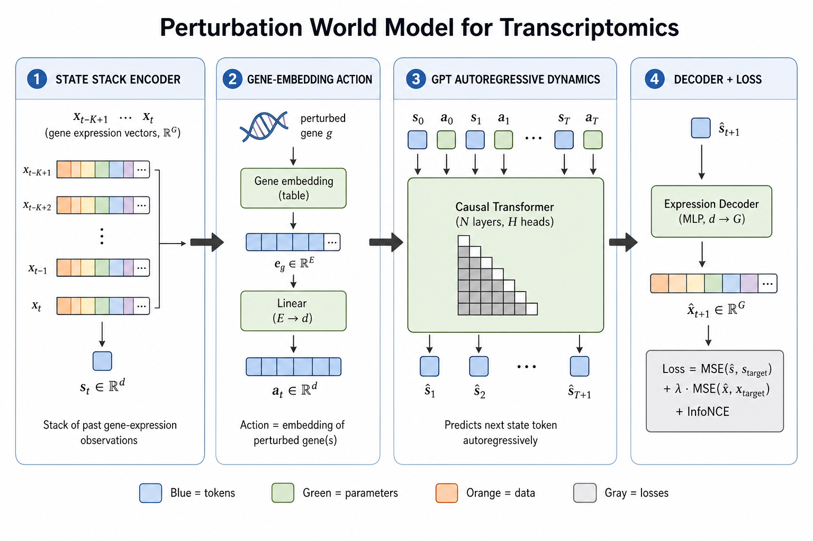
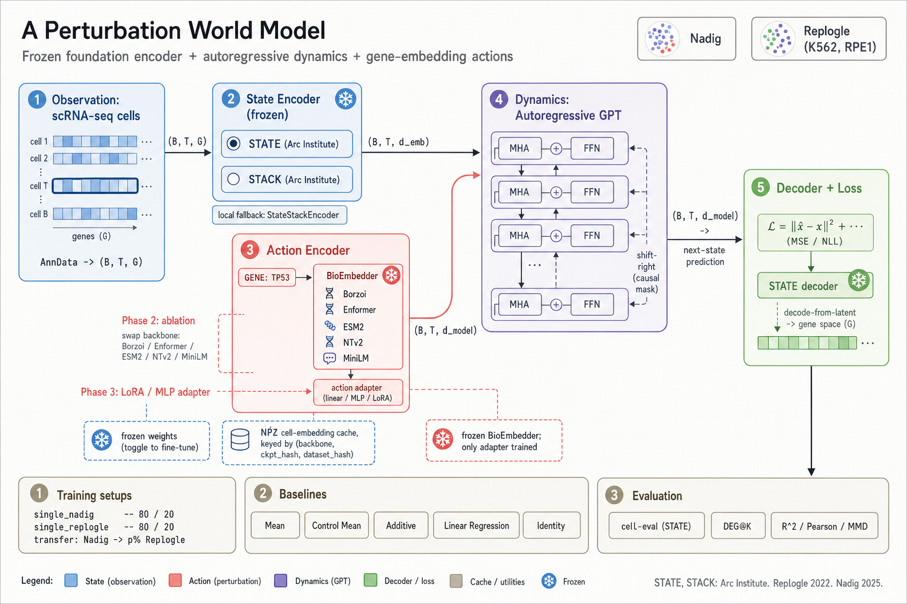
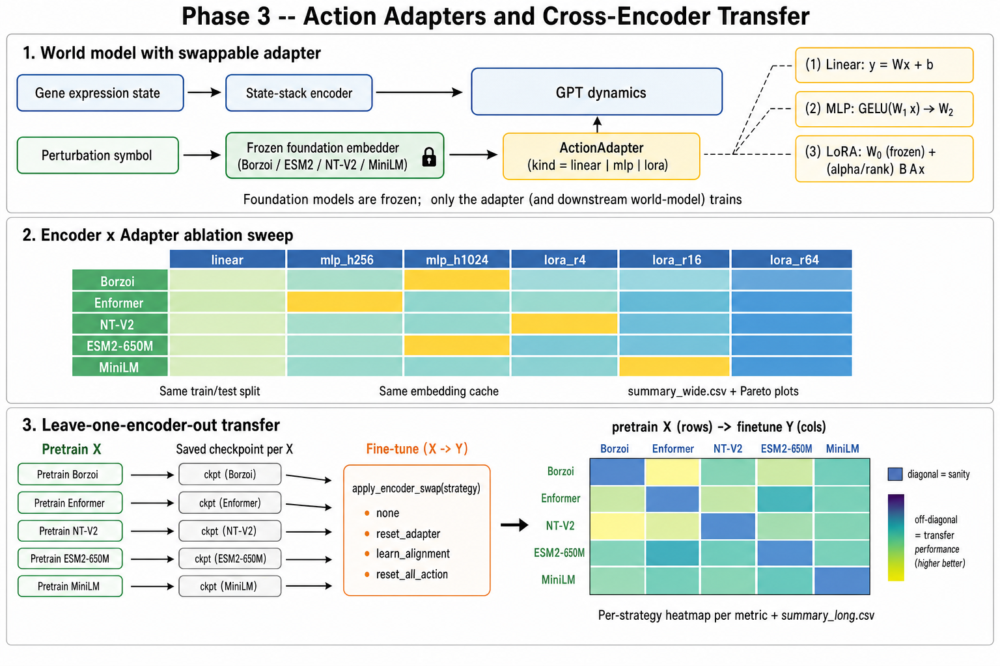

# Perturbation World Model for Transcriptomics

A modular implementation of an autoregressive (state, action) world
model for single-cell transcriptomics. The model takes a sequence of
gene-expression observations and a sequence of genetic perturbations
and predicts the next-state observation autoregressively.

It adapts the world-model design proposed in
[Learning World Models for Unconstrained Goal Navigation](https://arxiv.org/pdf/2405.18193)
to perturb-seq data, and follows the modular implementation patterns
of [In-Context-Symmetries](https://github.com/Sharut/In-Context-Symmetries).

## Architecture



Pipeline overview:

1. **State stack encoder.** Each step `t` stacks `K` past
   gene-expression vectors `x in R^G`. A linear projection lifts each
   to `R^d`, then a small transformer with a CLS token aggregates the
   stack into a single state token `s_t in R^d`.
2. **Gene-embedding action encoder.** The perturbed gene's symbol is
   looked up in a pretrained gene embedding table (e.g. GenePT,
   gene2vec). The swappable `ActionAdapter` (Linear / MLP / LoRA) is
   then applied **per gene** to project each of the `n_pert` rows into
   `R^d`, and the resulting `(B, T, n_pert, d)` tensor is aggregated
   over the perturbation axis (mean by default, sum optionally), with
   padded slots masked out. The output is the action token
   `a_t in R^d`.
3. **GPT autoregressive dynamics.** State and action tokens are
   interleaved (`s_0, a_0, s_1, a_1, ...`) and fed through a causal
   transformer. The model reads next-state predictions
   `s_hat_{t+1}` off the action-token output positions.
4. **Decoder + loss.** An MLP decoder projects state tokens back to
   gene space (`R^d -> R^G`). The training objective combines
   next-state latent MSE, optional decoder MSE, and an optional
   InfoNCE term.

## Why this design?



*Method overview. Cells from **Nadig** and **Replogle** (K562, RPE1)
flow through a **frozen** foundation state encoder -- Arc Institute
`STATE` or `STACK`, with cell embeddings cached on disk keyed by
`(backbone, ckpt_hash, dataset_hash)`. A local-trainable
`StateStackEncoder` is available as a fallback for ablation and
debugging. A **gene-embedding action** -- produced by a frozen
`BioEmbedder` backbone (Borzoi / Enformer / ESM2 / NTv2 / MiniLM) with
a small trainable Linear / MLP / LoRA adapter -- conditions an
**autoregressive GPT-style dynamics**, whose next-state prediction is
decoded back to gene space by an `ExpressionDecoder`. The model is
trained under three regimes (`single_nadig`, `single_replogle`,
`Nadig -> p% Replogle` transfer) and benchmarked against five
baselines (Mean / Control Mean / Additive / Linear Regression /
Identity) using STATE's cell-eval suite (DEG@K, R^2 / Pearson / MMD).
The two dashed brackets in the figure highlight the Phase-2
(backbone-swap) and Phase-3 (adapter-kind: LoRA / MLP) ablations.*

### Mapping the reference paper to transcriptomics

| Paper component                | Transcriptomics counterpart                 |
| ------------------------------ | ------------------------------------------- |
| Stack of K image frames        | Stack of K gene-expression vectors          |
| ResNet trunk + flat token      | Per-frame Linear + Stack Transformer + CLS  |
| Discrete agent action          | Gene-embedding of the perturbed gene(s)     |
| GRU / world-model dynamics     | Causal GPT over `(s, a)` tokens             |
| Pixel reconstruction loss      | Gene-expression reconstruction (MSE)        |
| Latent consistency loss        | Latent next-state MSE (`s_hat` vs `s_next`) |
| Goal-conditioning              | Future work: condition on target cell-state |

### State-stack encoder

scRNA-seq observations are extremely noisy and zero-inflated. Stacking
`K` cells from the same condition averages out per-cell sampling noise
the same way frame stacking averages out per-frame motion blur in
Atari. Two encoder variants are provided:

* `TransformerStateStackEncoder` (default): per-frame linear projection
  followed by a small transformer encoder + CLS pooling. Closest
  analogue of the paper's ResNet trunk.
* `MLPStateStackEncoder`: cheap baseline that flattens `(K * G)` and
  runs an MLP. Useful as an ablation.

### Action encoding

The action representation is the embedding of the perturbed gene(s),
sharing the same vector space as any pretrained gene embedding the
user wants to drop in (GenePT, gene2vec, scGPT gene-token weights,
etc.). Index 0 is reserved for the control / non-targeting / padding
token, which lets the model learn an "identity action" as well.

#### What `n_pert` is, and what we aggregate over

`n_pert` is the **maximum number of genes co-perturbed at a single
timestep** in the dataset. For each `(b, t)` step,
`gene_indices[b, t, :]` lists the indices of the genes perturbed at
that step, right-padded with `0` (the reserved control / padding row)
when the local cardinality is smaller than `n_pert`. Concretely, for
a dataset with `n_pert = 2`:

```
double knockout of (A, B):  gene_indices[b, t, :] = [idx_A, idx_B]
single  knockout of (A)  :  gene_indices[b, t, :] = [idx_A,    0]
control (no targeting)   :  gene_indices[b, t, :] = [    0,    0]
```

The aggregation that produces the action token `a_t` is **over those
co-perturbed gene slots at the same timestep** -- it is not across
cells, not across time, and not across the embedding dimension. It is
a permutation-invariant set-aggregator over the set of perturbed
genes, which is the right inductive bias because biologically
perturbing `{A, B}` is the same event as perturbing `{B, A}`.

#### Project-then-aggregate pipeline

Multi-gene perturbations follow a **project-then-aggregate** flow:
the `ActionAdapter` (Linear / MLP / LoRA) is applied per gene over the
`n_pert` axis -- `nn.Linear` broadcasts cleanly over arbitrary leading
dims -- and the resulting `(B, T, n_pert, d)` tensor is aggregated by
masked mean (or sum) into a single `(B, T, d)` action token. Padded
slots (gene index 0) are excluded from the aggregation, and an
all-padding timestep falls back to `proj(table[0])` so control
timesteps still carry a meaningful signal.

For the same double-knockout `(A, B)` example, the encoder does:

```
e_A, e_B   = embed(idx_A), embed(idx_B)            in R^{E_g}     # lookup
z_A, z_B   = ActionAdapter(e_A), ActionAdapter(e_B) in R^{d}       # per-gene project
a_t        = (z_A + z_B) / 2                        in R^{d}       # mean-pool over n_pert
```

For the `Linear` adapter with `pool="mean"` this ordering is
byte-equivalent to the legacy aggregate-then-project path (linearity
of `W x + b` commutes with masked-mean); for the non-linear adapters
it is strictly more expressive, since each co-perturbed gene
undergoes its own non-linear transformation before the contributions
are combined.

### Training objectives

The total loss is a weighted sum of:

* `latent_mse` -- MSE between predicted next-state token `s_hat` and
  the encoder's output on the true next stack `s_next` (with stop-grad
  on the target, BYOL-style). This is the primary signal.
* `decoder_mse` -- MSE between the decoded gene-expression
  reconstruction and the true mean expression vector. Anchors the
  state space to gene space.
* `info_nce` (optional) -- contrastive alignment between predicted and
  true tokens within a batch. Helpful when paired data is sparse.

### Key shapes (defaults)

```
B = batch size                      = 64
T = sequence length                 = 8
K = stack size                      = 4
G = number of HVGs                  = 5000
d = model token width               = 256
E_g = pretrained gene embed dim     = 3072 (GenePT)

obs_stack         : (B, T, K, G)
action_indices    : (B, T, n_pert)        (long, in [0, n_genes_pert])
state tokens      : (B, T, d)
action tokens     : (B, T, d)
interleaved seq   : (B, 2T, d)
s_hat             : (B, T, d)
x_hat             : (B, T, G)
```

## File tree

```
src/embpy/world_model/
  __init__.py                              top-level package
  README.md                                this file
  assets/
    architecture.png                       the diagram embedded above
  configs/
    __init__.py
    base.py                                dataclass schema + YAML loader + CLI overrides
    nadig.yaml                             legacy single-config (kept for back-compat)
    replogle.yaml                          legacy single-config
    experiments/
      single_nadig.yaml                    Setup 1: 80/20 on Nadig
      single_replogle.yaml                 Setup 2: 80/20 on Replogle
      transfer.yaml                        Setup 3: pretrain Nadig -> fine-tune p% Replogle
      smoke.yaml                           Tiny CPU smoke-test config
  data/
    __init__.py
    dataloader.py                          build_dataloaders(...) -> DataArtifacts
    preprocessing.py                       HVG, log1p, collate
    splits.py                              perturbation- and cell-aware splits (NPZ cached)
    datasets/
      __init__.py
      base.py                              PerturbationSequenceDataset (now with .subset())
      nadig.py                             Nadig adapter
      replogle.py                          Replogle adapter
  models/
    __init__.py
    blocks.py                              MLP, attention, transformer block
    world_model.py                         composed WorldModel + factory
    encoders/state_stack_encoder.py        transformer + MLP variants
    action/gene_embedding_action.py        pretrained-embedding action encoder
    dynamics/gpt_autoregressive.py         Decision-Transformer-style dynamics
    decoders/expression_decoder.py         d -> G MLP decoder
  training/
    __init__.py
    losses.py                              latent / delta / Gaussian / InfoNCE
    schedulers.py                          cosine + linear warmup
    hooks.py                               Hook ABC + Console / CSV / TB / Plot / Checkpoint
    trainer.py                             WorldModelTrainer (hook-based)
  evaluation/
    __init__.py
    metrics.py                             L2, cosine, R^2, delta-Pearson (latent-space)
    rollouts.py                            imagined_rollout(...)
    perturbation_eval.py                   end-to-end harness (model + every baseline)
    cell_eval_runner.py                    cell_eval wrapper + internal fallback metrics
    prep.py                                AnnData prep for cell_eval
    plots.py                               PNG + SVG plotters used by train.py
    report.py                              report.md generator
    baselines/
      __init__.py                          ALL_BASELINES registry
      base.py                              Baseline ABC + BaselineTrainData
      identity.py                          IdentityBaseline (sanity floor)
      control_mean.py                      ControlMeanBaseline
      mean.py                              MeanBaseline (global perturbed mean)
      additive.py                          AdditiveBaseline (control + delta_p)
      linear.py                            LinearRegressionBaseline (Ridge)
  utils/
    checkpoint.py / logging.py / seeding.py
  scripts/
    __init__.py
    train.py                               single + transfer; full eval at the end
    eval.py                                eval_only entry point
    run_baselines.py                       fit + evaluate all baselines on the same split
    smoke_test.py                          end-to-end CPU smoke test
    submit_all.sh                          submit every SLURM setup in one command
    slurm/
      train_single_nadig.sbatch
      train_single_replogle.sbatch
      train_transfer.sbatch                parameterised over FRACTION
      run_baselines.sbatch
      eval_only.sbatch
  tests/
    __init__.py
    test_state_stack_encoder.py
    test_gene_embedding_action.py
    test_gpt_autoregressive.py
    test_world_model.py
    test_losses.py
    test_dataset.py
    test_baselines.py                      every baseline on synthetic data
    test_splits.py                         determinism + roundtrip
    test_hooks.py                          hook lifecycle + CSV writer
```

## Module-by-module

### `configs`

Plain dataclasses (`WorldModelConfig`, `DataConfig`, `EncoderConfig`,
`DynamicsConfig`, `LossConfig`, `OptimConfig`, `TrainConfig`) loaded
from YAML via `load_yaml_config(path)`.

**Why dataclasses, not Hydra?** Zero new dependencies, IDE-friendly
type checking, and trivial YAML interop. Hydra is overkill for a
single training script and complicates config-driven imports inside
notebooks.

### `data`

* `data.preprocessing` -- log-normalisation, dependency-free HVG
  selection, and a custom collate fn that stacks dataset samples into
  the world-model batch dict.
* `data.datasets.base` -- `GeneIndexer` (gene symbol <-> int row),
  `load_gene_embedding_table` (CSV / NPZ), and the core
  `PerturbationSequenceDataset` that emits `(T, K, G)` sequences.
* `data.datasets.nadig` and `data.datasets.replogle` -- thin
  `from_h5ad(...)` adapters that load the AnnData, run preprocessing,
  and return `(dataset, gene_table, indexer, gene_symbols)`.
* `data.dataloader.build_dataloaders(cfg)` -- one-call setup that
  takes a `DataConfig` and returns `train_loader`, `val_loader`, and
  the artefacts needed to instantiate the model.

### `models`

* `blocks` -- shared building blocks (`MLP`, `CausalSelfAttention`,
  `TransformerBlock`).
* `encoders.state_stack_encoder` -- `TransformerStateStackEncoder`
  (default) and `MLPStateStackEncoder`. Both subclass
  `StateStackEncoder` and accept `(B, T, K, G)`, return `(B, T, d)`.
* `action.gene_embedding_action` -- `GeneEmbeddingAction` looks up
  perturbed-gene rows in a pretrained embedding table, projects each
  row to `d_model` via the swappable `ActionAdapter` (Linear / MLP /
  LoRA), and then aggregates over the `n_pert` axis (mean / sum, with
  padded slots masked) into a single action token.
* `dynamics.gpt_autoregressive` -- `GPTAutoregressiveDynamics`,
  Decision-Transformer-style causal transformer over interleaved
  `(s, a)` tokens. The next-state prediction is read off the
  action-token output positions.
* `decoders.expression_decoder` -- MLP `d_model -> n_genes`. Optional
  log-variance head for Gaussian NLL training.
* `world_model.WorldModel` -- composes the four pieces and exposes
  `encode`, `encode_action`, `predict_next`, `decode`, `forward`,
  `loss` and `rollout`. A `build_world_model(...)` factory wires the
  defaults.

### `training`

* `losses` -- `latent_mse`, `delta_mse`, `gaussian_nll`, `info_nce`.
* `schedulers.build_scheduler` -- cosine + warmup, linear warmup,
  constant.
* `trainer.WorldModelTrainer` -- minimal training loop with AdamW,
  AMP on CUDA, gradient clipping and per-epoch checkpoints.

### `evaluation`

* `metrics` -- `latent_l2_error`, `cosine_similarity`,
  `expression_r2`, `delta_pearson` (the standard headline metric in
  the perturbation-prediction literature).
* `rollouts.imagined_rollout` -- runs autoregressive rollouts on a
  loader and aggregates metrics.

### `utils`

* `seeding.seed_everything(seed)` -- python / numpy / torch seeds.
* `logging.setup_logging` + `get_logger`.
* `checkpoint.save_checkpoint` / `load_checkpoint`.

### `scripts`

* `train.py` and `eval.py` -- thin `python -m` entry-points wrapping
  the pieces above.

## Install

```bash
# inside the embpy repo
pip install -e ".[torch]"

# optional: anndata / scanpy for real data loading
pip install anndata pyyaml
```

## Prepare data

This project expects the two datasets to live under `data/` at the
repo root:

```
data/
  datasets/
    nadig/NadigOConner2024_jurkat.h5ad
    nadig/NadigOConner2024_hepg2.h5ad
    replogle/replogle_2022_k562_essential.h5ad
    replogle/replogle_2022_k562_gwps.h5ad
    replogle/replogle_2022_rpe1.h5ad
  embeddings/
    gene_embeddings/
      genept/embeddings_3072.csv      first column = gene symbol
```

The defaults in `configs/replogle.yaml` and `configs/nadig.yaml`
already point at these locations. Edit them to retarget.

## Train

The package now ships **three training setups**, all driven by the same
`scripts/train.py` entry point. The YAML config alone selects which one
runs (no special branches in the code):

| Setup                       | Config                                                | Mode flag      |
| --------------------------- | ----------------------------------------------------- | -------------- |
| `single_nadig`              | `configs/experiments/single_nadig.yaml`               | `mode: single` |
| `single_replogle`           | `configs/experiments/single_replogle.yaml`            | `mode: single` |
| `transfer_nadig_to_replogle`| `configs/experiments/transfer.yaml`                   | `mode: transfer` |

### Locally

```bash
# single-dataset (Nadig)
pixi run -e gpu python -m embpy.world_model.scripts.train \
    --config src/embpy/world_model/configs/experiments/single_nadig.yaml

# single-dataset (Replogle)
pixi run -e gpu python -m embpy.world_model.scripts.train \
    --config src/embpy/world_model/configs/experiments/single_replogle.yaml

# transfer: pretrain on Nadig, fine-tune on 10% of Replogle
pixi run -e gpu python -m embpy.world_model.scripts.train \
    --config src/embpy/world_model/configs/experiments/transfer.yaml \
    transfer.finetune_fraction=0.10
```

Dotted CLI overrides (`encoder.d_model=512`, `train.n_epochs=20`,
`split.split_by=cell`, etc.) are accepted as positional arguments after
`--config`; unknown keys raise immediately so typos surface.

### On SLURM (pixi gpu env)

The launchers under `world_model/scripts/slurm/` activate the existing
pixi `gpu` env exactly like `submission_scripts/jupyter_pixi.sbatch`:

```bash
# single setups
sbatch src/embpy/world_model/scripts/slurm/train_single_nadig.sbatch
sbatch src/embpy/world_model/scripts/slurm/train_single_replogle.sbatch

# transfer at p in {1, 5, 10, 25, 50}%
for p in 0.01 0.05 0.10 0.25 0.50; do
    FRACTION=$p sbatch src/embpy/world_model/scripts/slurm/train_transfer.sbatch
done

# everything in one shot: train (3 setups) -> baselines -> compare/report
# chained via `sbatch --dependency=afterok:...`.
bash src/embpy/world_model/scripts/submit_all.sh
```

`submit_all.sh` submits, for each of the three setups:

```
train_<setup>  -->  run_baselines  -->  compare + make_report
```

so when the chain finishes, every `outputs/<run_id>/` ends up with a
`comparison.csv`, `comparison.png`, and `report.md` automatically.
Skip a setup with `SKIP_NADIG=1`, `SKIP_REPLOGLE=1`, `SKIP_TRANSFER=1`.

Defaults: `--gres=gpu:1`, `--cpus-per-task=8`, `--mem=64G`,
`--time=24:00:00`. The partition / qos lines are commented; uncomment
and / or set via env (`PARTITION=gpu_p QOS=gpu_normal sbatch ...`)
to match your cluster.

Per-script summary:

| Script                          | Purpose                                                              |
| ------------------------------- | -------------------------------------------------------------------- |
| `train_single_nadig.sbatch`     | Setup 1: train on Nadig only.                                        |
| `train_single_replogle.sbatch`  | Setup 2: train on Replogle only.                                     |
| `train_transfer.sbatch`         | Setup 3: pretrain on Nadig, fine-tune on `FRACTION` of Replogle.     |
| `run_baselines.sbatch`          | Fit + evaluate every baseline against the saved split.               |
| `eval_only.sbatch`              | Re-evaluate a finished checkpoint without retraining.                |
| `compare.sbatch`                | Build `comparison.csv` + `comparison.png` + `report.md`.             |

### Train/test split policy

The default and recommended split is **by perturbation identity**
(`split.split_by: perturbation`): test perturbations are *unseen* by
the model, which is the scientifically meaningful generalisation
setting. Set `split.split_by: cell` for a per-cell sanity check (any
sufficiently expressive model trivially memorises this -- never
report headline numbers from cell-level splits).

Splits are computed once and persisted to
`outputs/<run_id>/splits/<dataset>.npz`. Every subsequent run
(world model, baselines, eval-only) reuses the same file, so model and
baselines are compared on byte-identical train/test indices.

## Evaluate

```bash
# evaluate a checkpoint (model + baselines + plots + report)
pixi run -e gpu python -m embpy.world_model.scripts.eval \
    --config src/embpy/world_model/configs/experiments/single_replogle.yaml \
    --checkpoint outputs/world_model/single_replogle/single_replogle_final.pt

# or via SLURM
CONFIG=src/embpy/world_model/configs/experiments/single_replogle.yaml \
CKPT=outputs/world_model/single_replogle/single_replogle_final.pt \
    sbatch src/embpy/world_model/scripts/slurm/eval_only.sbatch
```

The full pipeline runs:

1. cell-eval-style metrics (MSE, MAE, R^2, Pearson, Spearman, DEG
   overlap@K) per perturbation and aggregated.
2. Plots: loss curves, predicted-vs-real scatter, per-perturbation R^2
   violin, DEG overlap bar, baseline-vs-model comparison. Saved as
   PNG + SVG under `outputs/<run_id>/plots/`.
3. `outputs/<run_id>/report.md` -- self-contained markdown summary
   with config dump, metric tables, and embedded plots.

## Baselines

Five small baselines under `evaluation/baselines/` share a
`Baseline` interface (`fit`, `predict`, `name`):

| Baseline           | Predicts                                          | Beats identity when                                              |
| ------------------ | ------------------------------------------------- | ---------------------------------------------------------------- |
| `IdentityBaseline` | `control_template`                                | never (sanity floor)                                             |
| `ControlMeanBaseline` | train-control mean                              | never (no perturbation signal)                                   |
| `MeanBaseline`     | mean of all train-perturbed cells                  | global response direction is informative                          |
| `AdditiveBaseline` | `control + delta(p)` if `p` seen in train          | only for cell-level splits or when p was observed                |
| `LinearRegressionBaseline` | Ridge: action embedding -> per-gene delta  | gene embedding carries the perturbation signal                   |

Run them against the same split as a world-model run:

```bash
pixi run -e gpu python -m embpy.world_model.scripts.run_baselines \
    --config src/embpy/world_model/configs/experiments/single_replogle.yaml \
    --checkpoint outputs/world_model/single_replogle/single_replogle_final.pt

# or via SLURM
CONFIG=src/embpy/world_model/configs/experiments/single_replogle.yaml \
CKPT=outputs/world_model/single_replogle/single_replogle_final.pt \
    sbatch src/embpy/world_model/scripts/slurm/run_baselines.sbatch
```

Outputs:

* `outputs/<run_id>/baselines.csv`  -- one row per (baseline, metric).
* `outputs/<run_id>/comparison.csv` -- wide format, world model + every baseline.
* `outputs/<run_id>/plots/comparison.png` -- bar chart per metric.

## Comparison and final report (standalone)

After `train.py` and `run_baselines.py` have produced their CSVs the
final comparison + report can be regenerated independently:

```bash
# build comparison.csv + comparison.png
pixi run -e gpu python -m embpy.world_model.scripts.compare \
    --run-dir outputs/world_model/single_replogle

# render report.md from whatever already exists in run-dir
pixi run -e gpu python -m embpy.world_model.scripts.make_report \
    --run-dir outputs/world_model/single_replogle
```

These two scripts read only files on disk (`config.yaml`,
`baselines.csv`, `world_model_metrics.csv`, `comparison.csv`,
`plots/*.png`, `eval/per_pert_*.csv`); they require no model state, so
they are safely re-runnable.

### Adding a new baseline

1. Drop a file `evaluation/baselines/my_baseline.py` defining a
   subclass of `Baseline`. Implement `fit(data)` and
   `predict(perturbations, control_template)`.
2. Register it in `evaluation/baselines/__init__.py` by adding it to
   the `ALL_BASELINES` registry. That's it -- it now participates in
   `run_baselines.py` and the plotting / report pipeline.

### Adding a new metric

Two layers exist:

1. Reusable numpy helpers in `evaluation/metrics.py`
   (`mse`, `mae`, `r2_score`, `pearson_corr`, `spearman_corr`,
   `deg_overlap_top_k`). Any new helper added there should also be
   re-exported from `evaluation/__init__.py`.
2. The metric *set* used by the comparison pipeline lives in
   `evaluation/cell_eval_runner.py::_internal_metrics`. Add a column
   there to make the new metric flow through `comparison.csv`,
   `comparison.png`, and `report.md` automatically. When `cell_eval`
   is installed and `eval.use_cell_eval=true`, metrics come from
   cell-eval directly -- add it upstream there for a real STATE
   evaluation.

Minimal template:

```python
# evaluation/metrics.py
def my_metric(real: np.ndarray, pred: np.ndarray) -> float:
    """One-line description."""
    return float(...)

# evaluation/cell_eval_runner.py::_internal_metrics
rows.append({
    ...,
    "my_metric": my_metric(real_mean, pred_mean),
    ...,
})
```

## How do I test that it runs?

A complete end-to-end smoke test that finishes in well under five
minutes on a laptop without GPU:

```bash
pixi run -e gpu python -m embpy.world_model.scripts.smoke_test
```

This runs the same code path as a real run on a tiny Nadig subset
(256 HVGs, 2 epochs, 64 sequences/epoch, batch size 8, all baselines,
the full eval pipeline) and asserts that all expected output files
(`train_log.csv`, `report.md`, `comparison.csv`, `plots/loss_curves.png`,
`plots/comparison.png`) exist before exiting.

## Output layout

Every run / baseline pass / comparison job writes into the same
`outputs/<run_id>/` directory so chaining and re-runs stay coherent:

```
outputs/<run_id>/
  config.yaml                        resolved config (used by make_report.py)
  train.log / baselines.log / ...    one log file per script
  splits/<dataset>.npz               deterministic train/test indices
  ckpt_epoch<NNN>.pt                 periodic checkpoints
  <run_name>_final.pt                end-of-training checkpoint
  train_log.csv                      per-epoch metrics (CSV; mirror of TB)
  tb/                                TensorBoard event files
  eval/
    real.h5ad                        test cells (true expression)
    pred_<name>.h5ad                 model / baseline predictions
    per_pert_<name>.csv              per-perturbation metric tables
  baselines.csv                      long format: (baseline, metric, value)
  world_model_metrics.csv            single-row world-model summary
  comparison.csv                     wide format: world model + every baseline
  plots/
    loss_curves.png/.svg
    scatter_world_model.png/.svg
    perpert_r2.png/.svg
    deg_overlap.png/.svg
    comparison.png/.svg
  report.md                          single self-contained markdown summary
```

## How to read the plots and report

* `plots/loss_curves.png` -- per-epoch train/val loss. Both should
  decrease together; a growing gap indicates overfitting (drop
  `train.n_epochs` or raise `optim.weight_decay` / `dynamics.dropout`).
* `plots/scatter_world_model.png` -- predicted vs real *mean*
  expression per perturbation. Points should cluster around the
  identity line; systematic bias appears as a slope.
* `plots/perpert_r2.png` -- distribution of R^2 across test
  perturbations. A wide tail of negative values means the model is
  worse than control on those perturbations.
* `plots/deg_overlap.png` -- top-K differentially expressed gene
  overlap per perturbation. A robust target is ~0.4-0.6 for K=50;
  random baselines hover around K/G.
* `plots/comparison.png` -- world model vs every baseline on each
  aggregated metric. The world model should beat every baseline on
  at least the headline ones (R^2, delta-cosine, DEG overlap).
* `report.md` -- one self-contained markdown file embedding the
  config, the metric tables, and links to all plots.

## Training diagnostics

The trainer routes everything through pluggable hooks
(`training/hooks.py`):

* per-step train loss, learning rate, gradient norm, every loss
  component -> stdout (every `train.log_every_n_steps`),
* per-epoch train/val loss + components -> CSV at
  `outputs/<run_id>/train_log.csv` and TensorBoard at
  `outputs/<run_id>/tb/`,
* loss curves + report rendered automatically at end of training.

Drop hooks by passing `hooks=[]` to `WorldModelTrainer.__init__`; add
custom ones by subclassing `Hook`.

## Tests

```bash
pytest src/embpy/world_model/tests
```

Each test file targets a single component on tiny synthetic inputs, so
the suite finishes in seconds on CPU.

## References

* Hu et al. *Learning World Models for Unconstrained Goal Navigation.*
  arXiv 2024. <https://arxiv.org/pdf/2405.18193>
* Garg et al. *In-Context-Symmetries.* GitHub.
  <https://github.com/Sharut/In-Context-Symmetries>
* Replogle et al. *Mapping information-rich genotype-phenotype
  landscapes with genome-scale Perturb-seq.* Cell 2022.
* Nadig & O'Connor et al. *Transcriptome-wide characterization of
  genetic perturbations.* 2024.
* Cui et al. *GenePT: A simple but hard-to-beat foundation model for
  genes and cells built from ChatGPT.* 2023.

## Debug checklist (component-by-component)

Every component can be exercised in isolation. Commands assume the
repo root and `pixi run -e gpu` for the GPU env.

### Data

```bash
pixi run -e gpu python -m pytest -x src/embpy/world_model/tests/test_dataset.py
pixi run -e gpu python -m pytest -x src/embpy/world_model/tests/test_splits.py
```

Expected: every test passes. Sanity-check a real dataset interactively:

```python
from embpy.world_model.configs import DataConfig, SplitConfig
from embpy.world_model.data import build_dataloaders
art = build_dataloaders(DataConfig(...), split_cfg=SplitConfig())
print(art.split.summary())
print(art.train_dataset[0]["obs_stack"].shape)  # (T, K, G)
```

### Encoder

```bash
pixi run -e gpu python -m pytest -x src/embpy/world_model/tests/test_state_stack_encoder.py
```

Expected output shape: `(B, T, d_model)`. Encoder collapse check:
`encoder(batch["obs_stack"]).std() ~ 1.0` after a short training run.

### Action encoder

```bash
pixi run -e gpu python -m pytest -x src/embpy/world_model/tests/test_gene_embedding_action.py
```

Confirm two different perturbations produce *distinct* tokens (cosine
similarity below 1).

### Dynamics

```bash
pixi run -e gpu python -m pytest -x src/embpy/world_model/tests/test_gpt_autoregressive.py
```

`test_dynamics_is_causal` enforces the causal mask: the dynamics
output at position `t` must not depend on tokens at `t' > t`.

### Loss

```bash
pixi run -e gpu python -m pytest -x src/embpy/world_model/tests/test_losses.py
pixi run -e gpu python -m pytest -x src/embpy/world_model/tests/test_world_model.py
```

`test_world_model.py` exercises the composite loss: `loss.backward()`
must succeed end-to-end.

### Trainer hooks

```bash
pixi run -e gpu python -m pytest -x src/embpy/world_model/tests/test_hooks.py
```

Checks: lifecycle order (start -> epoch loop -> end), CSV header +
rows, console logger does not crash without TensorBoard.

### Baselines

```bash
pixi run -e gpu python -m pytest -x src/embpy/world_model/tests/test_baselines.py
```

Each baseline is run on a tiny synthetic dataset where the perturbation
effect is a deterministic shift; the linear baseline must beat the
identity baseline given the true action embeddings.

### Baselines

```bash
pixi run -e gpu python -m pytest -x src/embpy/world_model/tests/test_baselines.py
```

Each baseline is exercised on a tiny synthetic dataset where the
perturbation effect is a deterministic shift; the linear baseline
must beat the identity baseline given the true action embeddings.

### Numpy metric helpers

```bash
pixi run -e gpu python -m pytest -x src/embpy/world_model/tests/test_metrics.py
```

Closed-form expected values for `mse`, `mae`, `r2_score`,
`pearson_corr`, `spearman_corr`, `deg_overlap_top_k` are checked.

### AnnData prep + plotting

```bash
pixi run -e gpu python -m pytest -x src/embpy/world_model/tests/test_prep.py
pixi run -e gpu python -m pytest -x src/embpy/world_model/tests/test_plots.py
```

Verifies that `prep.build_real_anndata` / `prep.build_pred_anndata`
produce aligned AnnData objects with the expected obs / var layout, and
that every plotting helper writes both PNG and SVG.

### Eval pipeline end-to-end (smoke test)

```bash
pixi run -e gpu python -m embpy.world_model.scripts.smoke_test
```

Must finish under five minutes on CPU and leave behind:

```
outputs/world_model/smoke/
  config.yaml
  train_log.csv
  report.md
  comparison.csv
  baselines.csv
  world_model_metrics.csv
  plots/loss_curves.png
  plots/comparison.png
```

### Compare / report (post-hoc)

```bash
# regenerate comparison.csv + comparison.png from a finished run
pixi run -e gpu python -m embpy.world_model.scripts.compare \
    --run-dir outputs/world_model/smoke

# regenerate report.md from whatever exists in run-dir
pixi run -e gpu python -m embpy.world_model.scripts.make_report \
    --run-dir outputs/world_model/smoke
```

### SLURM submission

Syntax-check every launcher without submitting (no actual job is queued):

```bash
for f in src/embpy/world_model/scripts/slurm/*.sbatch; do
    bash -n "$f" && echo OK "$f"
done
bash -n src/embpy/world_model/scripts/submit_all.sh && echo OK submit_all.sh
```

Expected: every line prints `OK <path>`. Submit smallest first
(`train_single_nadig.sbatch`); `logs/wm-nadig_<jobid>.out` should print
"Run single_nadig -- output_dir=outputs/world_model/single_nadig"
within seconds of the job starting.

## Action embeddings

The world model treats a perturbation as the embedding of the perturbed
gene(s). Where that embedding *comes from* is selected at config time
through the `action_embedding` block. Two backends ship with the
package:

| backend         | source                                | used for                                                         |
| --------------- | ------------------------------------- | ---------------------------------------------------------------- |
| `precomputed`   | CSV / NPZ on disk (legacy code path)  | reproducing prior runs, swapping in any custom embedding         |
| `bio_embedder`  | `embpy.embedder.BioEmbedder`          | foundation-model embeddings (Borzoi, ESM2, ESMC, prot_t5, ...)   |

Both backends return the same `(table, indexer)` tuple downstream code
expects, so the rest of the world model is identical regardless of the
source.

### Provider abstraction

The seam is `world_model/data/embeddings/provider.py::ActionEmbeddingProvider`:

```python
class ActionEmbeddingProvider(ABC):
    @property
    def name(self) -> str: ...
    @property
    def embedding_dim(self) -> int: ...
    def embed(self, symbols) -> np.ndarray: ...
    def build_table(self, symbols) -> tuple[np.ndarray, GeneIndexer]: ...
```

Adding a third backend (e.g. fetching from a vector DB) is roughly:

1. Subclass `ActionEmbeddingProvider`, implement `embed` (the default
   `build_table` is fine).
2. Register it in `data/embeddings/registry.py::build_provider` under a
   new `source: "<your_backend>"` value.
3. Optional: persist a richer `ProviderMetadata` for `action_embedding_meta.json`.

### Cache layout

`BioEmbedderProvider` writes an NPZ archive per cache key:

```
{cache_dir}/{model_name}/{region}_{pooling}_{organism}.npz
{cache_dir}/{model_name}/{region}_{pooling}_{organism}.npz.lock   # fcntl advisory lock
```

Each NPZ holds two arrays: `symbols: object[N]` and `embeddings:
float32[N, D]`. Subsequent calls with the same key only embed the
*new* symbols and merge them into the archive via a temp-file +
`os.replace` atomic rename (so readers always see the old or the new
file, never a half-written one). The default `cache_dir` is
`outputs/_cache/action_embeddings/`.

### Switching the action representation

Same Replogle config, swap `model_name`:

```bash
# (a) precomputed (default; legacy NPZ / CSV)
pixi run -e gpu python -m embpy.world_model.scripts.train \
    --config src/embpy/world_model/configs/experiments/single_replogle.yaml

# (b) BioEmbedder + ESM2 (650M)
pixi run -e gpu python -m embpy.world_model.scripts.train \
    --config src/embpy/world_model/configs/experiments/single_replogle_esm2.yaml

# (c) BioEmbedder + Borzoi (DNA, exons only) -- one-line CLI override
pixi run -e gpu python -m embpy.world_model.scripts.train \
    --config src/embpy/world_model/configs/experiments/single_replogle_esm2.yaml \
    action_embedding.model_name=borzoi_v0 \
    action_embedding.region=exons
```

Pre-cache the embeddings before launching training (recommended so the
first epoch starts immediately):

```bash
pixi run -e gpu python -m embpy.world_model.scripts.embed_perturbations \
    --dataset replogle \
    --h5ad data/datasets/replogle/replogle_2022_k562_essential.h5ad \
    --model esm2_650M \
    --output outputs/_cache/action_embeddings/esm2_650M/full_mean_human.npz
```

### Supported `model_name` values

These come straight from `embpy.embedder.MODEL_REGISTRY`. Selected
representatives by modality:

| modality | examples                                                                      |
| -------- | ----------------------------------------------------------------------------- |
| DNA      | `enformer_human_rough`, `borzoi_v0..v3`, `flashzoi_v0..v3`, `evo1_8k`, `evo2_7b`, `nt_v2_500m`, `hyenadna_*`, `gena_lm_*` |
| Protein  | `esm2_8M`..`esm2_15B`, `esmc_300m`..`6b`, `esm3_*`, `prot_t5_xl`              |
| Text     | `minilm_l6_v2`, `bert_base_uncased`, `llama3.x_*`                             |

Run `python -c "from embpy.embedder import MODEL_REGISTRY; print(sorted(MODEL_REGISTRY))"`
for the full, env-aware list.

### Action-embedding debug checklist

| symptom                                          | what to inspect                                                                                              |
| ------------------------------------------------ | ------------------------------------------------------------------------------------------------------------ |
| Loss does not move; baselines beat the model     | `cat outputs/<run>/action_embedding_meta.json` -- check `embedding_dim` is non-zero and `n_unresolved` is small |
| Half the test perturbations show identical predictions | Same file -- `n_unresolved` near `n_symbols` means rows are zero, the model has no signal for those genes  |
| Transfer training blows up after pretrain        | Check `embedding_dim` in `outputs/<run>/pretrain/action_embedding_meta.json` vs `finetune/action_embedding_meta.json` -- they must match |
| Slow first epoch                                 | Run `scripts/embed_perturbations.py` first to populate the cache                                             |
| Want to revert from BioEmbedder to precomputed   | Set `action_embedding.source: precomputed` and `action_embedding.path: <your_npz>` (or leave empty to fall back to `data.gene_embedding_path`); no retraining needed if you just want to re-evaluate |

Inspect the cache directly:

```bash
ls outputs/_cache/action_embeddings/
ls outputs/_cache/action_embeddings/esm2_650M/        # one folder per model
python -c "import numpy as np; a=np.load('outputs/_cache/action_embeddings/esm2_650M/full_mean_human.npz', allow_pickle=True); print(len(a['symbols']), a['embeddings'].shape)"
```

## Ablating the action encoder

Once the provider abstraction is wired in, "which action encoder
matters?" becomes a one-config-file question. The ablation harness
trains the *same* world model on the *same* dataset with the *same*
train/test split, swapping only the `action_embedding` block, then
emits a single CSV that puts every backend on the same row.

### One-liner: run the sweep locally on CPU

```bash
# Two-spec smoke ablation: text + protein, on top of smoke.yaml. <10 min on a laptop.
pixi run -e gpu python -m embpy.world_model.scripts.ablate_action_encoder \
    --base-config src/embpy/world_model/configs/experiments/smoke.yaml \
    --grid src/embpy/world_model/configs/experiments/ablation_action_encoder.yaml \
    --output-root outputs/ablation_smoke \
    --only minilm,esm2_650m
```

### One-liner: run the sweep on the cluster

```bash
# Single job that walks the grid sequentially:
sbatch src/embpy/world_model/scripts/slurm/ablate_action_encoder.sbatch

# Or fan out one spec per array task (5 specs in the default grid):
sbatch --array=0-4 src/embpy/world_model/scripts/slurm/ablate_action_encoder.sbatch

# Or use submit_all.sh, which also pre-warms the BioEmbedder cache and chains the aggregator + report:
bash src/embpy/world_model/scripts/submit_all.sh --ablate-action-encoder \
    --base-config src/embpy/world_model/configs/experiments/single_replogle.yaml \
    --grid src/embpy/world_model/configs/experiments/ablation_action_encoder.yaml \
    --array
```

### Adding a new backend to the grid

Zero lines of Python. Add one row to the grid YAML:

```yaml
# src/embpy/world_model/configs/experiments/ablation_action_encoder.yaml
grid:
  - key: flashzoi
    model_name: flashzoi_v0
    region: full
    pooling: mean
    notes: "DNA, 3x faster Borzoi"
```

`spec.key` becomes the per-run sub-directory (`<output_root>/flashzoi/`)
and the column key in `summary_wide.csv`. Re-run the sweep --
previously-completed specs are detected via the action-embedding cache
and skipped at the resolver layer.

### How to read `summary_wide.csv`

`summary_wide.csv` is the headline artifact. One row per spec, columns
in order:

| column                                | meaning                                                          |
| ------------------------------------- | ---------------------------------------------------------------- |
| `grid_key`                            | spec identifier (e.g. `borzoi`)                                  |
| `model_name`, `id_type`, `region`, `pooling` | the action-embedding overrides applied                    |
| `status`                              | `"ok"` or `"failed"`                                             |
| `embedding_dim`, `n_unresolved`       | from `action_embedding_meta.json`                                |
| `wall_clock_s`, `peak_gpu_mem_mb`     | from the runner's per-spec `_ablation_run.json`                  |
| `final_train_loss`, `final_val_loss`  | scraped from `train_log.csv`                                     |
| `error`                               | populated only when `status == "failed"`                         |
| `r2`, `mse`, `pearson`, `deg_overlap_top_k`, ... | one column per metric in `world_model_metrics.csv`    |

Quick comparisons from the long form:

```python
import pandas as pd
df = pd.read_csv("outputs/ablation_action_replogle/summary_long.csv")
df.query("metric == 'r2' and status == 'ok'").sort_values("value", ascending=False)
```

The companion plots in `outputs/<root>/plots/` give:

* `metric_bar_<metric>.png` -- one bar per spec, easiest visual sort.
* `embedding_dim_vs_<metric>.png` -- does adding capacity (larger
  embedding_dim) actually help? (often: no, by a lot.)
* `pareto_<metric>_vs_walltime.png` -- the Pareto frontier between
  quality and training cost.

### What to do when a spec fails

1. Check `logs/<job>.err` (or `outputs/<root>/<key>/_ablation_run.json` for the in-process traceback).
2. Inspect `outputs/<root>/<key>/action_embedding_meta.json`. The two
   most common failure modes are:
   * `embedding_dim == 0` -- every symbol failed to resolve. Usually a
     bad `id_type` (DNA models need `symbol` or `ensembl_id`, never
     `uniprot_id`) or the wrong `organism`.
   * `n_unresolved == n_symbols` -- the resolver works but the model
     itself is failing. Likely an optional dep missing (Evo, Boltz, ...).
3. Re-run only the failing spec without redoing the others:
   ```bash
   pixi run -e gpu python -m embpy.world_model.scripts.ablate_action_encoder \
       --base-config src/embpy/world_model/configs/experiments/single_replogle.yaml \
       --grid src/embpy/world_model/configs/experiments/ablation_action_encoder.yaml \
       --output-root outputs/ablation_action_replogle \
       --only flashzoi
   ```
4. Re-run the aggregator on its own (no retraining of any spec):
   ```bash
   pixi run -e gpu python -m embpy.world_model.evaluation.ablation.aggregate \
       --output-root outputs/ablation_action_replogle \
       --grid src/embpy/world_model/configs/experiments/ablation_action_encoder.yaml
   ```


## Action adapters and cross-encoder transfer



The figure above summarises the three new pieces:

1. **World model with a swappable adapter** -- the foundation embedder
   stays frozen; the adapter (linear / mlp / lora) is the *only*
   trainable bridge to the dynamics token width.
2. **Encoder x adapter ablation sweep** -- a 5x6 grid that holds the
   train/test split and embedding cache fixed, so any difference in the
   summary tables is attributable to the (encoder, adapter) pair.
3. **Leave-one-encoder-out (LOEO) transfer** -- two SLURM array stages
   (pretrain reuse on the diagonal, off-diagonal fine-tunes through
   `apply_encoder_swap`) producing one heatmap per metric per swap
   strategy.

### Why an adapter sweep matters

The foundation model that produces the action embedding (Borzoi, ESM2,
NT-V2, ...) stays frozen. The only learned bridge between its output
dimension and the dynamics token width is a small projection -- the
*adapter*. With Phase 1/2 you got a single `nn.Linear`; Phase 3 lets
you swap in `MLP` (more non-linear capacity) or `LoRA` (a frozen base
linear plus a low-rank residual). The adapter sweep tells you, for the
*same* foundation embeddings, how much of the headroom is attributable
to extra adapter capacity vs the foundation model itself.

### Why the leave-one-encoder-out matrix matters

Real transfer scenarios rarely fix the encoder: you might want to
pretrain on a dataset for which DNA-CRISPR coverage is good (Borzoi
shines) and fine-tune on one where protein-context perturbations
dominate (ESM2 shines). The leave-one-encoder-out (LOEO) matrix
trains 5x5 cells: rows = pretrain encoder X, columns = fine-tune
encoder Y. The diagonal is the same-encoder transfer baseline; the
off-diagonal cells let you compare three explicit swap strategies:

* `reset_adapter`     -- keep dynamics + state encoder + decoder; rebuild only the adapter.
* `learn_alignment`   -- freeze everything; learn a small `Linear(d_Y, d_X)` against shared symbols, then prepend it to the original frozen adapter.
* `reset_all_action`  -- rebuild the entire action encoder; only dynamics + state encoder survive.

If `learn_alignment` rows are close to the diagonal, your encoders agree
geometrically once you bridge them; if `reset_all_action` is stronger,
the original action encoder was the bottleneck.

### Three commands

Adapter sweep (smoke run on CPU):

```bash
pixi run -e gpu python -m embpy.world_model.scripts.ablate_action_adapter \
    --base-config src/embpy/world_model/configs/experiments/smoke.yaml \
    --grid src/embpy/world_model/configs/experiments/ablation_action_adapter.yaml \
    --output-root outputs/ablation_adapter_smoke \
    --only linear,lora_r4
```

Encoder x adapter cross sweep (30 cells; expect 6-12h on a single A100
for full Replogle, much less for smoke):

```bash
pixi run -e gpu python -m embpy.world_model.scripts.ablate_encoder_x_adapter \
    --base-config src/embpy/world_model/configs/experiments/single_replogle.yaml \
    --encoder-grid src/embpy/world_model/configs/experiments/ablation_action_encoder.yaml \
    --adapter-grid src/embpy/world_model/configs/experiments/ablation_action_adapter.yaml \
    --output-root outputs/cross_replogle
```

Leave-one-encoder-out (5 pretrains + 20 off-diagonal fine-tunes):

```bash
pixi run -e gpu python -m embpy.world_model.scripts.leave_one_encoder_out \
    --base-config src/embpy/world_model/configs/experiments/transfer.yaml \
    --grid src/embpy/world_model/configs/experiments/ablation_action_encoder.yaml \
    --strategy reset_adapter \
    --output-root outputs/lone_replogle
```

On the cluster, the `--lone` flag launches the whole DAG:

```bash
bash src/embpy/world_model/scripts/submit_all.sh --lone \
    --base-config src/embpy/world_model/configs/experiments/transfer.yaml \
    --grid src/embpy/world_model/configs/experiments/ablation_action_encoder.yaml \
    --strategy reset_adapter \
    --output-root outputs/lone_replogle
```

### Reading the heatmap and `summary_wide.csv`

`outputs/lone_replogle/<strategy>/heatmaps/<metric>.png` is a 5x5 grid
where the rows are pretrain encoders and the columns are fine-tune
encoders. To argue something like *"encoder Y closes the gap with
encoder X under `learn_alignment`"*, look up the cell `X -> Y` and
compare against the diagonal `X -> X` cell. If
`learn_alignment[X][Y] / learn_alignment[X][X] > 0.95` for the metric
you care about, the alignment bridge is recovering most of the within-
encoder performance. The same comparison across strategies tells you
which swap is the cheapest path to recover the diagonal.

`summary_wide.csv` (in `outputs/ablation_adapter_*/`) has one row per
adapter spec and one column per metric, plus `kind`, `hidden_dim`,
`lora_rank`, and a closed-form `param_count`. A quick pandas one-liner
to find the best metric per parameter-count bucket:

```python
import pandas as pd
df = pd.read_csv("outputs/ablation_adapter_replogle/summary_wide.csv")
df.sort_values("r2", ascending=False)[["grid_key", "kind", "param_count", "r2"]]
```

### What to do when a swap fails

* **Dim mismatch with `swap_strategy="none"`** -- the helper raises with
  the exact `(d_pretrain, d_finetune)` tuple. Either align the encoders
  via `transfer.pretrain_action_encoder = transfer.finetune_action_encoder`,
  or pick `reset_adapter` / `learn_alignment` / `reset_all_action`.
* **Frozen-grad assertion failure** -- a downstream optimizer is
  expecting a gradient on the adapter's frozen `W0`. Inspect the log
  line `[swap=<strategy>] trainable params: total=N {...}` -- the
  `action_encoder` count must drop accordingly.
* **`alignment_loss` does not decrease** -- `_train_alignment` logs
  the per-epoch MSE. If it plateaus high, the two encoders place
  shared symbols in incompatible geometries; switch to
  `reset_all_action` and accept paying the full retrain cost on the
  action side.
* **`learn_alignment needs at least 2 shared perturbation symbols`** --
  Nadig and Replogle perturbation sets are disjoint enough that the
  intersection is empty; switch to `reset_adapter` or pre-process the
  AnnDatas to a shared symbol vocabulary.

## Phase 3 debug checklist

Adapter parity regression test (the one that pins `kind="linear"`
byte-equivalent to the pre-Phase-3 `nn.Linear`):

```bash
pixi run -e gpu pytest -k adapter_factory_parity src/embpy/world_model/tests
```

Param counts for each adapter at the same `(d_in, d_model)`:

```bash
pixi run -e gpu python -c "
from embpy.world_model.models.action.adapters import LinearAdapter, MLPAdapter, LoRAAdapter
adapters = [
    ('linear',     LinearAdapter(1280, 256)),
    ('mlp_h512',   MLPAdapter(1280, 256, hidden_dim=512, dropout=0.0)),
    ('mlp_h1024',  MLPAdapter(1280, 256, hidden_dim=1024, dropout=0.0)),
    ('lora_r4',    LoRAAdapter(1280, 256, rank=4, alpha=1.0)),
    ('lora_r16',   LoRAAdapter(1280, 256, rank=16, alpha=1.0)),
    ('lora_r64',   LoRAAdapter(1280, 256, rank=64, alpha=1.0)),
]
for name, ad in adapters:
    n_train = sum(p.numel() for p in ad.parameters() if p.requires_grad)
    n_total = sum(p.numel() for p in ad.parameters())
    print(f'{name:10s} trainable={n_train:>8d} total={n_total:>8d}')
"
```

Run a 2-spec adapter sweep on smoke.yaml end-to-end on CPU:

```bash
pixi run -e gpu python -m embpy.world_model.scripts.ablate_action_adapter \
    --base-config src/embpy/world_model/configs/experiments/smoke.yaml \
    --grid src/embpy/world_model/configs/experiments/ablation_action_adapter.yaml \
    --output-root outputs/ablation_adapter_smoke \
    --only linear,lora_r4
```

Run a 3-encoder leave-one-encoder-out diagonal sweep on CPU:

```bash
pixi run -e gpu python -m embpy.world_model.scripts.leave_one_encoder_out \
    --base-config src/embpy/world_model/configs/experiments/transfer.yaml \
    --grid src/embpy/world_model/configs/experiments/ablation_action_encoder.yaml \
    --strategy reset_adapter \
    --output-root outputs/lone_smoke \
    --diagonal-only --only enformer:enformer,esm2_650m:esm2_650m,minilm:minilm
```

Re-render the adapter aggregation without retraining anything:

```bash
pixi run -e gpu python -m embpy.world_model.evaluation.ablation.aggregate \
    --mode adapter \
    --output-root outputs/ablation_adapter_replogle \
    --grid src/embpy/world_model/configs/experiments/ablation_action_adapter.yaml
```

Compare any two specs head-to-head from `summary_long.csv`:

```python
import pandas as pd
df = pd.read_csv("outputs/ablation_adapter_replogle/summary_long.csv")
print(df[df.grid_key.isin(["linear", "lora_r16"])].pivot_table(
    index="metric", columns="grid_key", values="value", aggfunc="first"
))
```

---

## Foundation-model backbones (frozen STATE / STACK)

The state encoder of the world model now uses a frozen single-cell
foundation model instead of a small from-scratch transformer. The
existing `StateStackEncoder` is still available behind the same
abstraction (`kind: local`), so every pre-Phase-5 experiment keeps
running unchanged. The new backbones (`state`, `stack`) wrap
`embpy.models.singlecell_models.StateEmbeddingWrapper` and
`StackWrapper` respectively, with disk-backed cell-embedding caches
so the foundation forward only runs once per dataset.

### Options at a glance

| `state_backbone.kind` | Backbone                            | Extra dep   | Checkpoint files                              | Typical `embedding_dim` |
|-----------------------|-------------------------------------|-------------|-----------------------------------------------|-------------------------|
| `local` (default)     | `StateStackEncoder` (in-repo)       | none        | none                                          | `d_model` (e.g. 256)    |
| `state`               | STATE / SE-600M (Arc Institute)     | `arc-state` | `<folder>/*.ckpt`, `<folder>/protein_embeddings.pt` | `z_dim + z_dim_ds` (e.g. 768) |
| `stack`               | STACK (Arc Institute)               | `arc-stack` | `<ckpt>.ckpt`, `<genelist>.pkl`               | model-dependent (e.g. 512) |

### Install the opt-in deps

```bash
pip install 'embpy[state]'   # STATE only
pip install 'embpy[stack]'   # STACK only
# or with pixi:
pixi install -e state
pixi install -e stack
```

Both backbones lazy-import their upstream package inside
`provider._load()`, so `embpy.world_model` is fully importable on a
machine without `arc-state` / `arc-stack`. A missing dependency only
errors at the moment the user actually selects that backbone.

### YAML blocks

Local (default; equivalent to the pre-Phase-5 behavior):

```yaml
state_backbone:
  kind: "local"
  freeze: true
```

STATE:

```yaml
state_backbone:
  kind: "state"
  state_checkpoint: "data/checkpoints/SE-600M/se600m_epoch15.ckpt"
  state_model_folder: "data/checkpoints/SE-600M"
  state_protein_embeddings: null  # auto-detect from model_folder
  state_config: null
  device: "auto"
  freeze: true
  batch_size: 64
  cache_dir: "outputs/_cache/state_backbone"
  require_cache_hit: false
```

STACK:

```yaml
state_backbone:
  kind: "stack"
  stack_checkpoint: "data/checkpoints/stack/stack.ckpt"
  stack_genelist: "data/checkpoints/stack/hvg_genes.pkl"
  stack_gene_name_col: null  # auto-detect
  device: "auto"
  freeze: true
  batch_size: 32
  cache_dir: "outputs/_cache/state_backbone"
  require_cache_hit: false
```

Ready-to-run experiment configs are at
`configs/experiments/single_replogle_state.yaml` and
`configs/experiments/single_replogle_stack.yaml`.

### Smoke command

Always smoke-test the encode step before launching training. The CLI
runs the same code path the dataloader uses, so a green smoke run
means training will at least get past the foundation forward.

```bash
python -m embpy.world_model.scripts.encode_cells \
  --kind state \
  --adata data/datasets/replogle/replogle_2022_k562_essential.h5ad \
  --state-checkpoint data/checkpoints/SE-600M/se600m_epoch15.ckpt \
  --state-model-folder data/checkpoints/SE-600M \
  --output outputs/_cache/state_backbone/state/<hash>/<ds>.npz
```

The script prints `embedding_dim`, `n_cells`, wall-clock seconds, and
peak GPU memory in MB. A typical SE-600M forward on a 200k-cell
Replogle subset is ~1 GB peak GPU and a few minutes wall on an A100.

### How to fine-tune later

Once you want to stop freezing the backbone, flip a single switch and
point at the same checkpoint:

```yaml
state_backbone:
  kind: "state"
  state_checkpoint: "data/checkpoints/SE-600M/se600m_epoch15.ckpt"
  state_model_folder: "data/checkpoints/SE-600M"
  freeze: false        # <- end-to-end fine-tune
```

Expect a longer run (the backbone is the parameter-count dominant
component) and a larger GPU footprint. Confirm the change took effect
by grepping the trainer log for the optimizer-param-groups line:

```text
Trainer optimizer param groups: total=602M -- head=4K dynamics=12M ... backbone_trainable=600M other=0
```

If `backbone_trainable` is still `0`, the YAML override didn't land
(check that `state_backbone.freeze: false` is at the top level, not
nested under `data:`).

### Failure runbook

| Symptom                                                                                          | Fix                                                                                                                                                                                                          |
|--------------------------------------------------------------------------------------------------|--------------------------------------------------------------------------------------------------------------------------------------------------------------------------------------------------------------|
| `ImportError: arc-state` (or `arc-stack`)                                                        | `pip install 'embpy[state]'` (or `[stack]`). The provider only fails at first encode, not at import time.                                                                                                    |
| `FileNotFoundError: protein_embeddings.pt`                                                       | Set `state_protein_embeddings` explicitly, or drop the file into `state_model_folder/protein_embeddings.pt`. STATE's decoder is gene-parametric; without these embeddings only the encode path works.        |
| `KeyError` on a gene symbol during STACK encode                                                  | The dataset's `adata.var` does not overlap STACK's training gene list. Try `stack_gene_name_col: gene_symbol` (or `feature_name`) explicitly; auto-detect uses the first column with a non-trivial overlap.   |
| OOM during STATE / STACK encode                                                                  | Lower `state_backbone.batch_size`. The cache is persisted incrementally only at the end of a successful encode -- if you OOM you re-encode from scratch.                                                      |
| `require_cache_hit=True` but cache miss                                                          | A cluster eval-only job hit a checkpoint or AnnData it has not seen. Run `encode_cells.py` once on the head node, then re-launch the job -- the cluster job will then pick up the warm cache.                 |
| `Row mismatch` from `_maybe_pre_encode_with_backbone`                                            | The dataset's `cell_type_filter` does not match the AnnData. Either set `data.cell_type_filter` to the same value used at dataset construction, or strip the filter and let both code paths see all cells.    |

### Inspect the cache

```bash
python -m embpy.world_model.models.encoders.backbones.cache \
  --inspect outputs/_cache/state_backbone
```

Prints one row per cached NPZ: `BACKBONE  N_CELLS  DIM  SIZE_MB  PATH`,
plus a total at the bottom.

### Citations

* STATE (Arc Institute) -- repository: <https://github.com/ArcInstitute/state>
* STACK (Arc Institute) -- repository: <https://github.com/ArcInstitute/stack>

---

## Debug checklist (Phase 5)

One-liners that cover the most common things to verify:

```bash
# 1. Confirm local backbone is bit-equivalent to the legacy path.
pixi run -e gpu pytest src/embpy/world_model/tests/test_local_backbone_parity.py -k local_backbone_parity -v

# 2. Encode a tiny AnnData with the STATE backbone (real weights).
python -m embpy.world_model.scripts.encode_cells \
  --kind state \
  --adata data/datasets/replogle/tiny.h5ad \
  --state-checkpoint data/checkpoints/SE-600M/se600m_epoch15.ckpt \
  --state-model-folder data/checkpoints/SE-600M \
  --output /tmp/se_tiny.npz

# 3. List what's currently cached and how big it is on disk.
python -m embpy.world_model.models.encoders.backbones.cache \
  --inspect outputs/_cache/state_backbone

# 4. Verify a frozen STATE backbone leaves no parameter trainable.
python -c "
from embpy.world_model.configs import StateBackboneConfig
from embpy.world_model.models.encoders.backbones import build_backbone
cfg = StateBackboneConfig(kind='state', state_checkpoint='data/checkpoints/SE-600M/se600m_epoch15.ckpt', state_model_folder='data/checkpoints/SE-600M', freeze=True)
p = build_backbone(cfg)
p._load()
assert all(not q.requires_grad for q in p.parameters()), 'freeze leak!'
print('OK: all', sum(1 for _ in p.parameters()), 'param tensors are frozen.')
"

# 5. Switch a run from local -> state -> stack and back without retraining:
#    only the dataloader re-encodes (or hits the cache) and only the
#    evaluator re-runs. The trained dynamics + decoder stay the same.
python -m embpy.world_model.scripts.train \
  --config src/embpy/world_model/configs/experiments/single_replogle.yaml \
  state_backbone.kind=local       # -> outputs/.../local
python -m embpy.world_model.scripts.train \
  --config src/embpy/world_model/configs/experiments/single_replogle_state.yaml
python -m embpy.world_model.scripts.train \
  --config src/embpy/world_model/configs/experiments/single_replogle_stack.yaml
```
